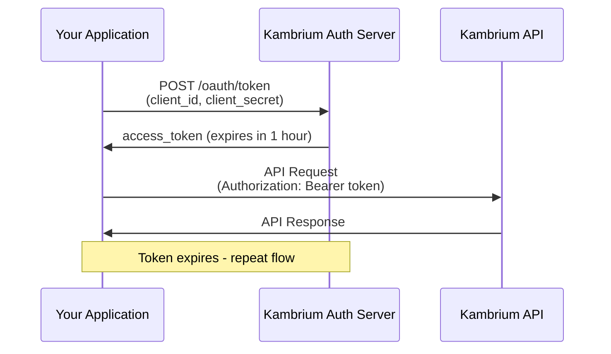

## Platform Overview

Kambrium provides a **three-layer architecture** that enables secure, scalable access to third-party SaaS tools through the Model Context Protocol (MCP):

<Card title="Three-Layer Architecture" icon="layer-group">
  1. **Management API** - Configure and manage your MCP server connections 2.
  **MCP Servers** - Protocol-compliant servers that standardize SaaS tool access
  3. **SaaS Tools** - Your existing business applications (Salesforce, Slack,
  etc.)
</Card>

### What is MCP?

The **Model Context Protocol** is an open standard that allows AI agents to securely connect to external data sources and tools. Instead of building custom integrations for each SaaS tool, MCP provides a standardized way for AI applications to interact with your business systems.

**Why use Kambrium vs. direct API integration?**

- **Standardized protocol** - One integration pattern for all tools
- **Built-in security** - OAuth 2.1 compliance with proper scoping
- **Agent-optimized** - Designed specifically for AI agent interactions
- **Simplified management** - Central dashboard for all connections

---

## Authentication Methods

Choose the authentication method that best fits your use case:

<CardGroup cols={2}>
  <Card
    title="Personal Access Tokens"
    icon="key"
    href="#personal-access-tokens"
  >
    **Recommended for:** Development, scripting, CI/CD pipelines Long-lived
    tokens that work like traditional API keys but with OAuth 2.1 compliance.
  </Card>

  <Card
    title="OAuth 2.1 Client Credentials"
    icon="shield-check"
    href="#oauth-client-credentials"
  >
    **Recommended for:** Production applications, server-to-server auth Standard
    OAuth flow with short-lived tokens and automatic refresh.
  </Card>
</CardGroup>

---

## Quick Start

### 1. Get Your Authentication Token

<Tabs>
  <Tab title="Personal Access Token">
    1. Log into your [Kambrium Dashboard](https://app.kambrium.com) 2. Navigate
    to **Settings > API Keys** 3. Click **Generate Personal Access Token** 4.
    Copy and store the token securely
    <Warning>
      Personal Access Tokens are displayed only once. Store them securely.
    </Warning>
  </Tab>

  <Tab title="OAuth Credentials">
    1. Log into your [Kambrium Dashboard](https://app.kambrium.com) 2. Navigate
    to **Settings > OAuth Applications** 3. Click **Create OAuth Application**
    4. Copy your `client_id` and `client_secret`
    <Info>
      OAuth credentials enable programmatic token generation for production
      systems.
    </Info>
  </Tab>
</Tabs>

### 2. Make Your First API Call

<CodeGroup>
```bash cURL
curl -H "Authorization: Bearer YOUR_TOKEN" \
  https://api.kambrium.com/v1/mcp-servers
```

```python Python
import requests

headers = {"Authorization": "Bearer YOUR_TOKEN"}
response = requests.get("https://api.kambrium.com/v1/mcp-servers", headers=headers)
print(response.json())
```

```javascript JavaScript
const response = await fetch("https://api.kambrium.com/v1/mcp-servers", {
  headers: {
    Authorization: "Bearer YOUR_TOKEN",
  },
});
const data = await response.json();
console.log(data);
```

</CodeGroup>

---

## Personal Access Tokens

Personal Access Tokens (PATs) provide a simple way to authenticate API requests without implementing the full OAuth flow.

### When to Use PATs

<CardGroup cols={2}>
  <Card title="✅ Good For" icon="check">
    - Development and testing - Scripting and automation - CI/CD pipelines -
    Internal tools - Quick prototyping
  </Card>

  <Card title="❌ Avoid For" icon="x">
    - User-facing applications - Third-party integrations - When you need user
    consent flows - High-security production systems
  </Card>
</CardGroup>

### PAT Security Best Practices

<AccordionGroup>
  <Accordion title="Token Storage" icon="database">
    - Store PATs in environment variables, never in code - Use secrets
    management systems in production - Rotate tokens regularly (recommended:
    every 90 days)
  </Accordion>

  <Accordion title="Access Control" icon="lock">
    - Generate separate PATs for different applications - Use descriptive names
    when creating tokens - Delete unused tokens immediately
  </Accordion>

  <Accordion title="Network Security" icon="shield">
    - Always use HTTPS for API requests - Implement proper error handling - Log
    authentication failures for monitoring
  </Accordion>
</AccordionGroup>

---

## OAuth 2.1 Client Credentials

For production applications, use OAuth 2.1 Client Credentials Grant for secure, short-lived token access.

### Implementation Flow



### Step 1: Create OAuth Application

1. Navigate to **Settings > OAuth Applications** in your dashboard
2. Click **Create OAuth Application**
3. Configure your application:
   - **Name**: Descriptive name for internal tracking
   - **Scopes**: Select required permissions (see [Scopes](#scopes))
   - **Redirect URIs**: Not needed for Client Credentials flow

### Step 2: Implement Token Exchange

<CodeGroup>
```python Python
import requests

def get_access_token(client_id, client_secret):
url = "https://auth.kambrium.com/oauth/token"
data = {
"grant_type": "client_credentials",
"client_id": client_id,
"client_secret": client_secret,
"scope": "mcp:read mcp:write"
}

    response = requests.post(url, data=data)
    response.raise_for_status()

    return response.json()["access_token"]

# Use the token

token = get_access_token("your_client_id", "your_client_secret")
headers = {"Authorization": f"Bearer {token}"}

````

```javascript JavaScript
async function getAccessToken(clientId, clientSecret) {
  const response = await fetch('https://auth.kambrium.com/oauth/token', {
    method: 'POST',
    headers: {
      'Content-Type': 'application/x-www-form-urlencoded',
    },
    body: new URLSearchParams({
      grant_type: 'client_credentials',
      client_id: clientId,
      client_secret: clientSecret,
      scope: 'mcp:read mcp:write'
    })
  });

  const data = await response.json();
  return data.access_token;
}

// Use the token
const token = await getAccessToken('your_client_id', 'your_client_secret');
const headers = { 'Authorization': `Bearer ${token}` };
````

```bash cURL
curl -X POST https://auth.kambrium.com/oauth/token \
  -H "Content-Type: application/x-www-form-urlencoded" \
  -d "grant_type=client_credentials" \
  -d "client_id=YOUR_CLIENT_ID" \
  -d "client_secret=YOUR_CLIENT_SECRET" \
  -d "scope=mcp:read mcp:write"
```

</CodeGroup>

### Step 3: Handle Token Refresh

OAuth tokens expire after 1 hour. Implement automatic refresh logic:

<CodeGroup>
```python Python
import time
from datetime import datetime, timedelta

class KambriumAuth:
def **init**(self, client_id, client_secret):
self.client_id = client_id
self.client_secret = client_secret
self.token = None
self.expires_at = None

    def get_valid_token(self):
        if not self.token or datetime.now() >= self.expires_at:
            self._refresh_token()
        return self.token

    def _refresh_token(self):
        # Token exchange logic here
        response = self._exchange_token()
        self.token = response["access_token"]
        expires_in = response["expires_in"]
        self.expires_at = datetime.now() + timedelta(seconds=expires_in - 60)  # 60s buffer

````

```javascript JavaScript
class KambriumAuth {
  constructor(clientId, clientSecret) {
    this.clientId = clientId;
    this.clientSecret = clientSecret;
    this.token = null;
    this.expiresAt = null;
  }

  async getValidToken() {
    if (!this.token || Date.now() >= this.expiresAt) {
      await this.refreshToken();
    }
    return this.token;
  }

  async refreshToken() {
    const response = await this.exchangeToken();
    this.token = response.access_token;
    this.expiresAt = Date.now() + (response.expires_in - 60) * 1000; // 60s buffer
  }
}
````

</CodeGroup>

---

## Scopes

Scopes control what actions your application can perform. Request only the scopes you need.

| Scope        | Description                    | Use Cases                               |
| ------------ | ------------------------------ | --------------------------------------- |
| `mcp:read`   | Read MCP server configurations | Listing connections, viewing settings   |
| `mcp:write`  | Create and modify MCP servers  | Adding integrations, updating configs   |
| `mcp:delete` | Delete MCP server connections  | Removing integrations                   |
| `saas:oauth` | Initiate SaaS OAuth flows      | Creating authenticated SaaS connections |

### Scope Examples

<CodeGroup>
```bash Read Only Access
# For applications that only need to view configurations
scope=mcp:read
```

```bash Full Management Access
# For applications that manage integrations
scope=mcp:read mcp:write mcp:delete saas:oauth
```

```bash Integration Creation
# For applications that create new integrations
scope=mcp:read mcp:write saas:oauth
```

</CodeGroup>

---

## Rate Limits & Quotas

Protect your applications with proper rate limit handling:

<Info>
  **Current Limits:** - **Management API**: 100 requests/minute per token -
  **OAuth Token Exchange**: 10 requests/minute per client - **Burst allowance**:
  2x rate limit for 30 seconds
</Info>

### Rate Limit Headers

Every API response includes rate limit information:

```http
HTTP/1.1 200 OK
X-RateLimit-Limit: 100
X-RateLimit-Remaining: 87
X-RateLimit-Reset: 1640995200
X-RateLimit-Retry-After: 13
```

### Handling Rate Limits

<CodeGroup>
```python Python
import time
import requests

def make_api_request(url, headers):
response = requests.get(url, headers=headers)

    if response.status_code == 429:
        retry_after = int(response.headers.get('X-RateLimit-Retry-After', 60))
        print(f"Rate limited. Waiting {retry_after} seconds...")
        time.sleep(retry_after)
        return make_api_request(url, headers)  # Retry

    return response

````

```javascript JavaScript
async function makeApiRequest(url, headers) {
  const response = await fetch(url, { headers });

  if (response.status === 429) {
    const retryAfter = parseInt(response.headers.get('X-RateLimit-Retry-After') || '60');
    console.log(`Rate limited. Waiting ${retryAfter} seconds...`);
    await new Promise(resolve => setTimeout(resolve, retryAfter * 1000));
    return makeApiRequest(url, headers); // Retry
  }

  return response;
}
````

</CodeGroup>

---

## Security Best Practices

<CardGroup cols={2}>
  <Card title="Token Security" icon="key">
    - Never log or expose tokens in error messages - Use environment variables
    for token storage - Implement token rotation policies - Monitor for unusual
    token usage patterns
  </Card>

  <Card title="Network Security" icon="shield">
    - Always use HTTPS for API requests - Validate SSL certificates in
    production - Implement request signing for sensitive operations - Use IP
    allowlisting where possible
  </Card>

  <Card title="Application Security" icon="lock">
    - Validate all API responses - Implement proper error handling - Log
    authentication events for auditing - Use least-privilege principle for
    scopes
  </Card>

  <Card title="Monitoring" icon="chart-line">
    - Monitor rate limit usage - Set up alerts for authentication failures -
    Track token usage patterns - Implement health checks for OAuth flows
  </Card>
</CardGroup>

---

## Error Handling

### Authentication Errors

| Error Code | Description              | Solution                          |
| ---------- | ------------------------ | --------------------------------- |
| `401`      | Invalid or expired token | Refresh token or generate new PAT |
| `403`      | Insufficient permissions | Check required scopes             |
| `429`      | Rate limit exceeded      | Implement backoff strategy        |
| `500`      | Server error             | Retry with exponential backoff    |

### Example Error Response

```json
{
  "error": "invalid_token",
  "error_description": "The access token expired",
  "error_code": 401,
  "retry_after": 0
}
```

### Error Handling Implementation

<CodeGroup>
```python Python
def handle_api_error(response):
    if response.status_code == 401:
        # Token expired or invalid
        refresh_authentication()
        return "retry"
    elif response.status_code == 403:
        # Insufficient permissions
        raise PermissionError("Missing required scopes")
    elif response.status_code == 429:
        # Rate limited
        return "backoff"
    elif response.status_code >= 500:
        # Server error
        return "retry_with_backoff"
    else:
        response.raise_for_status()
```

```javascript JavaScript
function handleApiError(response) {
  switch (response.status) {
    case 401:
      // Token expired or invalid
      refreshAuthentication();
      return "retry";
    case 403:
      // Insufficient permissions
      throw new Error("Missing required scopes");
    case 429:
      // Rate limited
      return "backoff";
    default:
      if (response.status >= 500) {
        return "retry_with_backoff";
      }
      throw new Error(`API error: ${response.status}`);
  }
}
```

</CodeGroup>

---

## Testing Your Integration

### Test with cURL

Verify your authentication setup:

```bash
# Test with Personal Access Token
curl -H "Authorization: Bearer YOUR_PAT" \
  https://api.kambrium.com/v1/mcp-servers

# Test OAuth token exchange
curl -X POST https://auth.kambrium.com/oauth/token \
  -H "Content-Type: application/x-www-form-urlencoded" \
  -d "grant_type=client_credentials&client_id=YOUR_ID&client_secret=YOUR_SECRET"
```

### Validation Checklist

<AccordionGroup>
  <Accordion title="Authentication Setup" icon="check-circle">
    - [ ] Tokens stored securely (environment variables) - [ ] Proper scope
    configuration - [ ] Token refresh logic implemented - [ ] Rate limit
    handling in place
  </Accordion>

  <Accordion title="Error Handling" icon="exclamation-triangle">
    - [ ] 401/403 error responses handled - [ ] Retry logic for 5xx errors - [ ]
    Rate limit backoff strategy - [ ] Proper logging of auth events
  </Accordion>

  <Accordion title="Security" icon="shield-check">
    - [ ] HTTPS enforced for all requests - [ ] No tokens in logs or error
    messages - [ ] Minimal scope permissions - [ ] Regular token rotation
    schedule
  </Accordion>
</AccordionGroup>

---

## Next Steps

<CardGroup cols={2}>
  <Card title="Management API" href="/api-reference/introduction" icon="cog">
    Learn how to create and manage your MCP server connections
  </Card>

  <Card title="MCP Integration Guide" href="/guides/mcp-setup" icon="plug">
    Connect your first SaaS tool using the MCP protocol
  </Card>

  <Card title="Webhooks" href="/api-reference/endpoint/webhook" icon="webhook">
    Set up real-time notifications for connection events
  </Card>

  <Card title="SDKs & Examples" href="/examples" icon="code">
    Explore code examples and official SDKs
  </Card>
</CardGroup>

<Note>
  Need help? Join our [Discord community](https://discord.gg/kambrium) or
  contact [support@kambrium.com](mailto:support@kambrium.com).
</Note>{" "}
