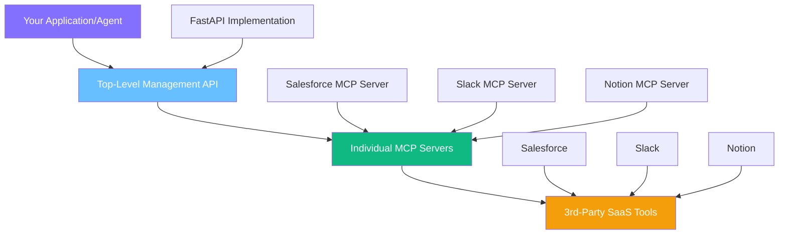

## Platform Overview

Kambrium provides **Model Context Protocol (MCP) Servers** that enable customers to connect to and interact with 3rd-party SaaS tools. The architecture is designed to be fully compliant with the MCP specification, leveraging a unified OAuth 2.1 framework for all API access, providing secure and user-friendly options for different client types and use cases.

### What is MCP?

The **Model Context Protocol** is an open standard that allows AI agents to securely connect to external data sources and tools. Instead of building custom integrations for each SaaS tool, MCP provides a standardized way for AI applications to interact with your business systems.

---

## Three-Layer Architecture

The Kambrium platform operates through three distinct layers that work together:



<CardGroup cols={1}>
  <Card title="Layer 1: Top-Level Management API" icon="cog">
    **Purpose:** High-level administrative API for managing the lifecycle of MCP Server connections
    
    **Technology:** FastAPI implementation that sits above individual MCP Servers
    
    **Available Methods:**
    - Get all available MCP Server integrations
    - Create new MCP Server connections  
    - Get own MCP Server connections
    - Delete own MCP Server connections
    - Edit own MCP Server connections
    
    **Authentication:** OAuth 2.1 with JWT tokens in `Authorization: Bearer <token>` header
  </Card>
  
  <Card title="Layer 2: Individual MCP Servers" icon="server">
    **Purpose:** Protocol-compliant servers that provide standardized access to specific SaaS tools
    
    **Function:** Each MCP Server handles the specific API implementation for one SaaS tool (Slack, Salesforce, Notion, etc.) and exposes it through the standardized MCP protocol
    
    **Lifecycle:** Managed through the Top-Level Management API
    
    **Compliance:** Fully MCP specification compliant
  </Card>
  
  <Card title="Layer 3: 3rd-Party SaaS Tools" icon="plug">
    **Purpose:** Your existing business applications and data sources
    
    **Examples:** Salesforce, Slack, Notion, GitHub, Google Workspace, HubSpot, etc.
    
    **Authentication:** Handled transparently through OAuth flows or API keys
    
    **Access:** Abstracted through the MCP protocol in Layer 2
  </Card>
</CardGroup>

---

## User Types & Access Patterns

There are three key entities that interact with the platform:

<Tabs>
  <Tab title="Agent Builder">
    **Definition:** A client of Kambrium who builds agents for their own
    end-users **Primary Interface:** Top-Level Management API (programmatic
    access) **Typical Workflow:** 1. Use OAuth 2.1 or PATs to authenticate with
    Management API 2. Create MCP Server connections for their application 3.
    Manage OAuth flows for their end-users 4. Integrate MCP servers into their
    AI agents/applications **Example Use Case:** A company building a customer
    service AI that needs access to Salesforce, Slack, and Notion for their
    enterprise customers
  </Tab>

{" "}

<Tab title="Agent Builder User">
  **Definition:** An end-user of an agent created by an Agent Builder **Platform
  Interaction:** Limited to OAuth consent pop-ups from 3rd-party SaaS providers
  **Typical Workflow:** 1. Use the Agent Builder's application 2. When prompted,
  authorize access to their SaaS tools (Salesforce, Slack, etc.) 3. Complete
  OAuth consent flow 4. Return to Agent Builder's application **Example Use
  Case:** A sales manager using their company's AI assistant who needs to grant
  access to their Salesforce account
</Tab>

  <Tab title="Direct User">
    **Definition:** A client of Kambrium who builds agents for their own
    personal or internal use **Primary Interface:** Dedicated web interface
    (Kambrium Dashboard) **Typical Workflow:** 1. Log into Kambrium web
    interface 2. Create and configure MCP Server connections through UI 3.
    Handle OAuth flows directly in the dashboard 4. Use connections in their
    personal AI tools **Example Use Case:** A developer building internal
    automation tools for their team
  </Tab>
</Tabs>

<Note>
  **Important:** Agent Builder and Direct User represent different usage
  patterns rather than strict user categories. Every user has access to a
  Top-Level API key, but we expect Agent Builders to primarily use programmatic
  access while Direct Users prefer the web interface.
</Note>

---

## Authentication Methods

The Top-Level Management API supports two authentication methods for programmatic access:

<CardGroup cols={2}>
  <Card title="OAuth 2.1 Client Credentials" icon="shield-check">
    **Recommended for:** Production server-to-server applications **How it
    works:** Generate `client_id` and `client_secret` in web UI, use these to
    programmatically request short-lived, expiring access tokens **Benefits:** -
    Short-lived tokens (enhanced security) - Automatic expiration - Industry
    standard - Suitable for production systems
  </Card>

  <Card title="Personal Access Tokens (PATs)" icon="key">
    **Recommended for:** Developer convenience, scripting, CI/CD pipelines **How
    it works:** Generate a long-lived JWT in the web UI that doesn't expire
    **Benefits:** - Simple "copy-paste" experience like traditional API keys -
    No token refresh logic needed - Fully compliant OAuth 2.1 tokens - Perfect
    for automation
  </Card>
</CardGroup>

---

## OAuth 2.1 Client Credentials Flow

### Step 1: Create OAuth Application

1. Log into your [Kambrium Dashboard](https://app.kambrium.com)
2. Navigate to **Settings > OAuth Applications**
3. Click **Create OAuth Application**
4. Save your `client_id` and `client_secret`

### Step 2: Request Access Token

<CodeGroup>
```bash cURL
curl -X POST https://auth.kambrium.com/oauth/token \
  -H "Content-Type: application/x-www-form-urlencoded" \
  -d "grant_type=client_credentials" \
  -d "client_id=YOUR_CLIENT_ID" \
  -d "client_secret=YOUR_CLIENT_SECRET"
```

```python Python
import requests

def get_access_token(client_id, client_secret):
    url = "https://auth.kambrium.com/oauth/token"
    data = {
        "grant_type": "client_credentials",
        "client_id": client_id,
        "client_secret": client_secret
    }

    response = requests.post(url, data=data)
    response.raise_for_status()

    return response.json()["access_token"]

# Usage
token = get_access_token("your_client_id", "your_client_secret")
```

```javascript JavaScript
async function getAccessToken(clientId, clientSecret) {
  const response = await fetch("https://auth.kambrium.com/oauth/token", {
    method: "POST",
    headers: {
      "Content-Type": "application/x-www-form-urlencoded",
    },
    body: new URLSearchParams({
      grant_type: "client_credentials",
      client_id: clientId,
      client_secret: clientSecret,
    }),
  });

  const data = await response.json();
  return data.access_token;
}
```

</CodeGroup>

### Step 3: Use Access Token

<CodeGroup>
```bash cURL
curl -H "Authorization: Bearer YOUR_ACCESS_TOKEN" \
  https://api.kambrium.com/v1/mcp-servers
```

```python Python
headers = {"Authorization": f"Bearer {token}"}
response = requests.get("https://api.kambrium.com/v1/mcp-servers", headers=headers)
```

```javascript JavaScript
const headers = { Authorization: `Bearer ${token}` };
const response = await fetch("https://api.kambrium.com/v1/mcp-servers", {
  headers,
});
```

</CodeGroup>

---

## Personal Access Tokens (PATs)

### Creating a PAT

1. Log into your [Kambrium Dashboard](https://app.kambrium.com)
2. Navigate to **Settings > API Keys**
3. Click **Generate Personal Access Token**
4. Copy and store the token securely

<Warning>
  Personal Access Tokens are displayed only once. Store them securely in
  environment variables or secrets management systems.
</Warning>

### Using Your PAT

<CodeGroup>
```bash cURL
curl -H "Authorization: Bearer YOUR_PAT_TOKEN" \
  https://api.kambrium.com/v1/mcp-servers
```

```python Python
import os
import requests

# Store PAT in environment variable
token = os.getenv('KAMBRIUM_PAT')
headers = {"Authorization": f"Bearer {token}"}

response = requests.get("https://api.kambrium.com/v1/mcp-servers", headers=headers)
```

```javascript JavaScript
// Store PAT in environment variable
const token = process.env.KAMBRIUM_PAT;
const headers = { Authorization: `Bearer ${token}` };

const response = await fetch("https://api.kambrium.com/v1/mcp-servers", {
  headers,
});
```

</CodeGroup>

---

## Creating MCP Server Connections

The process for creating MCP Server connections differs based on user type:

### For Direct Users (Web Interface)

Direct Users create and configure MCP Server connections through the Kambrium web interface:

1. **Log into Dashboard:** Access your Kambrium dashboard
2. **Choose Integration:** Browse available SaaS integrations
3. **Configure Connection:** Provide connection name and settings
4. **Authentication Options:**
   - **SaaS API Keys:** Directly provide API keys from your SaaS tools
   - **OAuth Flow:** Complete OAuth authorization with the SaaS provider
5. **Test Connection:** Verify the connection is working
6. **Use in Applications:** Connect your AI tools to the MCP server

### For Agent Builders (Programmatic)

Agent Builders create MCP Server connections on behalf of their users through the Management API:

<CodeGroup>
```bash cURL
curl -X POST https://api.kambrium.com/v1/mcp-servers \
  -H "Authorization: Bearer YOUR_TOKEN" \
  -H "Content-Type: application/json" \
  -d '{
    "integration_type": "salesforce",
    "name": "Customer Salesforce",
    "user_id": "user_123",
    "configuration": {
      "environment": "production"
    }
  }'
```

```python Python
import requests

def create_mcp_server(token, integration_type, name, user_id):
    url = "https://api.kambrium.com/v1/mcp-servers"
    headers = {
        "Authorization": f"Bearer {token}",
        "Content-Type": "application/json"
    }
    data = {
        "integration_type": integration_type,
        "name": name,
        "user_id": user_id,
        "configuration": {
            "environment": "production"
        }
    }

    response = requests.post(url, headers=headers, json=data)
    return response.json()

# Create server for user
server = create_mcp_server(token, "salesforce", "Customer Salesforce", "user_123")
print(f"Created server: {server['id']}")
```

</CodeGroup>

### SaaS Authentication Process

Once an MCP Server is created, it needs to authenticate with the target SaaS tool:

<Tabs>
  <Tab title="For Agent Builder Users">
    1. **Initiate OAuth:** Agent Builder's application triggers OAuth flow 2.
    **User Redirect:** User is redirected to SaaS provider (e.g., Salesforce
    login) 3. **Grant Permissions:** User authorizes access to their SaaS
    account 4. **Return to App:** User returns to Agent Builder's application 5.
    **Connection Active:** MCP Server can now access SaaS data
  </Tab>

  <Tab title="For Direct Users">
    1. **Dashboard OAuth:** Click "Connect" button in Kambrium dashboard 2.
    **SaaS Login:** Redirected to SaaS provider login page 3. **Grant
    Permissions:** Authorize Kambrium to access SaaS account 4. **Return to
    Dashboard:** Redirected back to Kambrium dashboard 5. **Connection Active:**
    MCP Server is ready to use
  </Tab>
</Tabs>

---

## API Reference

### Authentication Headers

All API requests must include authentication:

```http
Authorization: Bearer <your_token>
Content-Type: application/json
```

### Base URLs

- **Management API:** `https://api.kambrium.com`
- **OAuth Server:** `https://auth.kambrium.com`
- **MCP Servers:** `https://mcp.kambrium.com`

### Common Operations

<AccordionGroup>
  <Accordion title="List Available Integrations" icon="list">
    ```bash GET https://api.kambrium.com/v1/integrations ``` Returns all
    available SaaS integrations you can create MCP servers for.
  </Accordion>

{" "}
<Accordion title="Create MCP Server" icon="plus">
  ```bash POST https://api.kambrium.com/v1/mcp-servers ``` Creates a new MCP
  server connection to a SaaS tool.
</Accordion>

{" "}
<Accordion title="List Your MCP Servers" icon="server">
  ```bash GET https://api.kambrium.com/v1/mcp-servers ``` Returns all MCP
  servers you have created.
</Accordion>

  <Accordion title="Delete MCP Server" icon="trash">
    ```bash DELETE https://api.kambrium.com/v1/mcp-servers/{server_id}
    ``` Permanently deletes an MCP server connection.
  </Accordion>
</AccordionGroup>

---

## Security Best Practices

<CardGroup cols={2}>
  <Card title="Token Security" icon="shield">
    - Store tokens in environment variables - Never commit tokens to version
    control - Use secrets management in production - Rotate PATs regularly
    (every 90 days) - Monitor token usage for anomalies
  </Card>

  <Card title="OAuth Security" icon="lock">
    - Use HTTPS for all OAuth redirects - Validate state parameters - Implement
    proper error handling - Use short-lived access tokens - Follow OAuth 2.1
    security guidelines
  </Card>
</CardGroup>

---

## Error Handling

### Common Authentication Errors

| Status Code | Error                 | Description                      | Solution                               |
| ----------- | --------------------- | -------------------------------- | -------------------------------------- |
| `401`       | `invalid_token`       | Token is malformed or expired    | Check token format, refresh if expired |
| `403`       | `insufficient_scope`  | Token lacks required permissions | Generate token with proper scopes      |
| `429`       | `rate_limit_exceeded` | Too many requests                | Implement exponential backoff          |

### Example Error Response

```json
{
  "error": "invalid_token",
  "error_description": "The access token has expired",
  "timestamp": "2024-01-15T10:30:00Z"
}
```

---

## Next Steps

<CardGroup cols={2}>
  <Card title="MCP Integration Guide" href="/guides/mcp-setup" icon="plug">
    Step-by-step guide to connecting your first SaaS tool
  </Card>
  
  <Card title="API Reference" href="/api-reference/introduction" icon="book">
    Complete Management API documentation
  </Card>
  
  <Card title="Dashboard" href="https://app.kambrium.com" icon="external-link">
    Access the Kambrium web interface
  </Card>

  <Card title="Support" href="mailto:support@kambrium.com" icon="envelope">
    Get help from our team
  </Card>
</CardGroup>

<Note>
  Need help getting started? Join our [Discord
  community](https://discord.gg/kambrium) or check out our [examples
  repository](https://github.com/kambrium/examples) for complete integration
  examples.
</Note>
