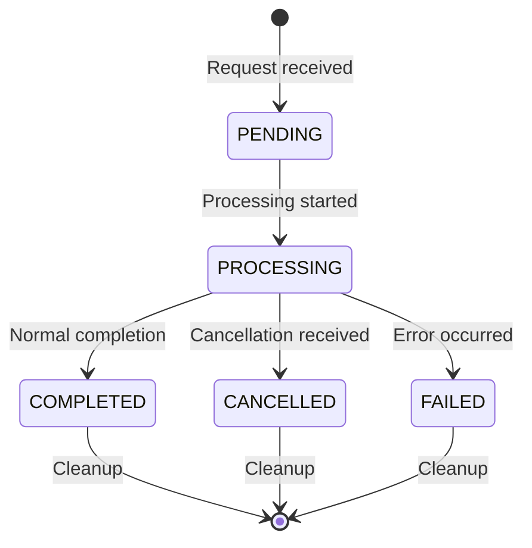
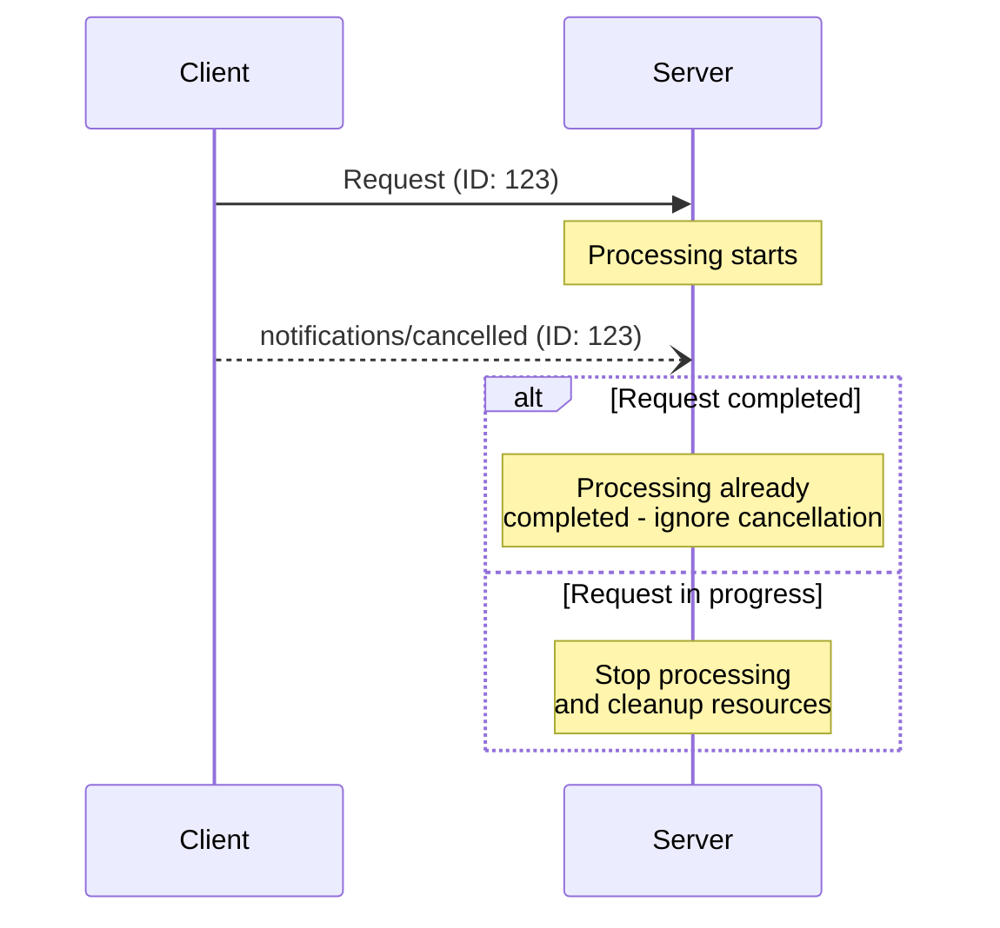

<div id="enable-section-numbers" />

<Info>**Protocol Revision**: 2025-03-26</Info>

Our MCP server implements request cancellation functionality through notification messages. Clients can send cancellation notifications to indicate that previously-issued requests should be terminated.

## Cancellation Flow

When a client wants to cancel an in-progress request, it sends a `notifications/cancelled` notification:

```json
{
  "jsonrpc": "2.0",
  "method": "notifications/cancelled",
  "params": {
    "requestId": "123",
    "reason": "User requested cancellation"
  }
}
```

## Implementation Features

Our cancellation manager provides:

- **Request tracking**: Monitors in-progress requests by ID
- **State management**: Tracks request states (pending, processing, completed, cancelled)
- **Race condition handling**: Handles cancellations that arrive after completion
- **Resource cleanup**: Automatically cleans up cancelled requests
- **Client-specific tracking**: Manages cancellations per client session

## Behavior Requirements

1. **Request validation**: Cancellation notifications reference previously-issued requests
2. **Initialize protection**: The `initialize` request cannot be cancelled
3. **Graceful handling**: Our server handles cancellations appropriately based on request state
4. **Response policy**: No response is sent for cancellation notifications (fire-and-forget)

## Server Response

Cancellation notifications return HTTP status codes:

- `202`: Cancellation acknowledged and processed
- `404`: Request not found or already completed
- `405`: Method not allowed (for invalid notification format)

## Request States

Our implementation tracks requests through these states:



## Configuration Options

Our cancellation manager supports:

```json
{
  "enabled": true,
  "max_tracked_requests": 1000,
  "request_cleanup_interval": 300,
  "log_cancellation_requests": true,
  "ignore_unknown_requests": true,
  "track_completion_time": true
}
```

## Race Condition Handling

Due to network latency, cancellation notifications may arrive after request completion. Our server handles these scenarios gracefully:



## Statistics and Monitoring

Our implementation tracks:

- Total requests processed
- Cancellation success rate
- Race condition occurrences
- Resource cleanup metrics
- Client-specific cancellation patterns

## Error Scenarios

Invalid cancellation notifications are handled gracefully:

- **Unknown request IDs**: Ignored (returns 404)
- **Already completed requests**: Ignored (returns 404)
- **Malformed notifications**: Logged and ignored

This maintains the fire-and-forget nature of notifications while providing robust cancellation capabilities integrated with our OAuth authentication and session management.
