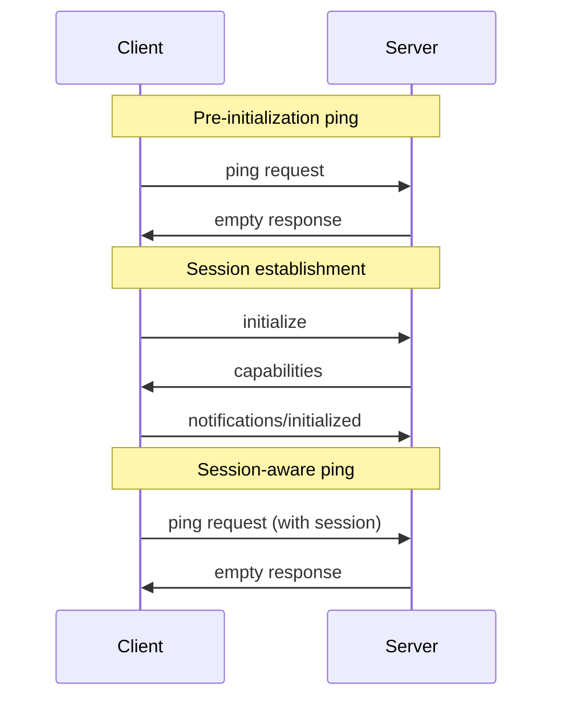

<div id="enable-section-numbers" />

<Info>**Protocol Revision**: 2025-03-26</Info>

Our MCP server implements the ping utility for connection health monitoring and verification. This allows clients to verify that the server is still responsive and the connection is alive.

## Overview

The ping functionality is implemented as a simple request/response pattern where either the client or server can verify connection status by sending a `ping` request.

## Message Format

A ping request is a standard JSON-RPC request with no parameters:

```json
{
  "jsonrpc": "2.0",
  "id": "123",
  "method": "ping"
}
```

## Server Response

Our server responds promptly with an empty response:

```json
{
  "jsonrpc": "2.0",
  "id": "123",
  "result": {}
}
```

## Behavior Implementation

1. **Pre-initialization**: Our server accepts ping requests before MCP initialization (as allowed by MCP protocol)
2. **Post-initialization**: Ping works normally with established sessions
3. **Response time**: Our server responds promptly to ping requests
4. **Error handling**: Connection timeouts may indicate server unavailability

## Session Support



## Usage Patterns

### Basic Health Check

```json
{
  "jsonrpc": "2.0",
  "id": "health-check-1",
  "method": "ping"
}
```

### Performance Monitoring

Our implementation supports multiple consecutive pings for performance monitoring and connection latency measurement.

## Implementation Details

- **Session agnostic**: Works before and after MCP initialization
- **Rate limiting**: Subject to standard server rate limiting policies
- **Authentication**: Requires valid OAuth token like all other requests
- **Timeout handling**: Client should implement reasonable timeout periods

## Error Handling

- **Connection timeout**: No response within timeout period indicates connection issues
- **Authentication errors**: Invalid OAuth tokens return standard auth errors
- **Server unavailable**: HTTP-level connection failures indicate server problems

Our ping implementation follows MCP protocol specifications while integrating with our OAuth-based authentication and session management systems.
