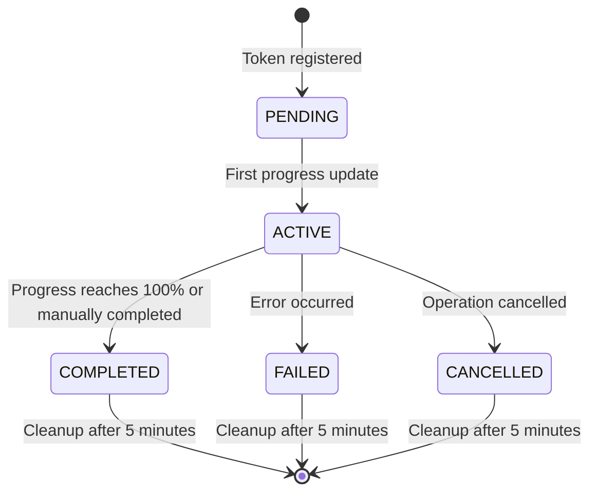
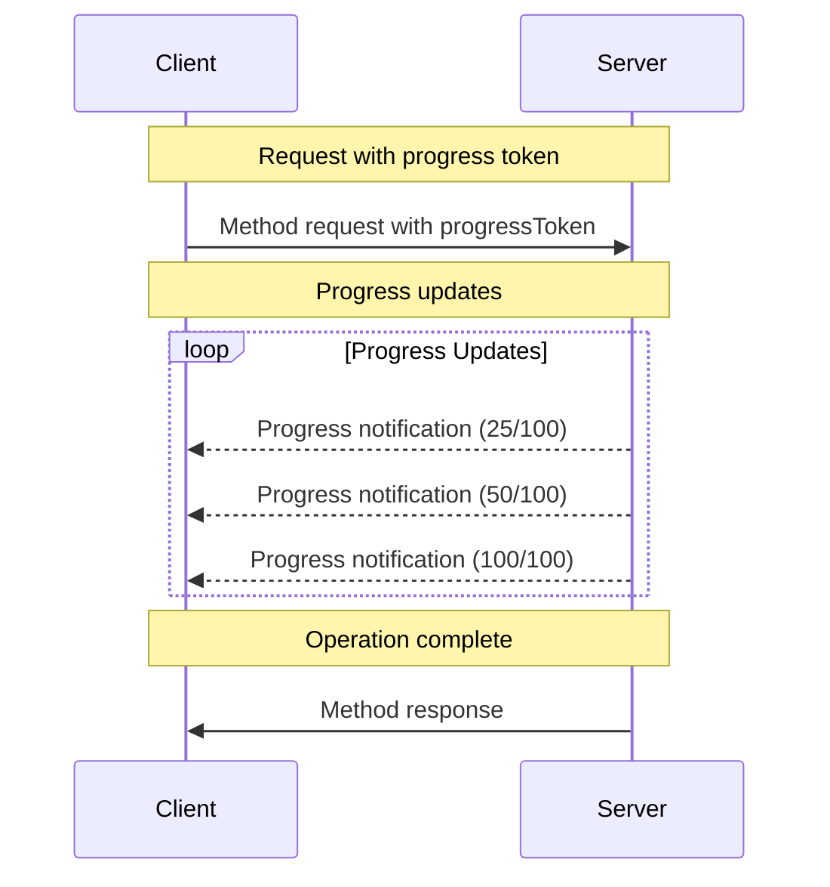

<div id="enable-section-numbers" />

<Info>**Protocol Revision**: 2025-03-26</Info>

Our MCP server implements progress tracking for long-running operations through notification messages. Clients can receive progress updates by including progress tokens in requests, and the server sends progress notifications.

## Progress Flow

When a client wants to receive progress updates for a request, it includes a `progressToken` in the request metadata:

```json
{
  "jsonrpc": "2.0",
  "id": 1,
  "method": "some_method",
  "params": {
    "_meta": {
      "progressToken": "operation-abc123"
    }
  }
}
```

The server may then send progress notifications:

```json
{
  "jsonrpc": "2.0",
  "method": "notifications/progress",
  "params": {
    "progressToken": "operation-abc123",
    "progress": 50,
    "total": 100,
    "message": "Processing files..."
  }
}
```

## Implementation Features

Our progress manager provides:

- **Token management**: Supports both string and integer progress tokens
- **Rate limiting**: Prevents notification flooding (max 60 notifications/minute)
- **State tracking**: Monitors operation states (pending, active, completed, failed, cancelled)
- **Resource cleanup**: Automatically cleans up completed operations
- **Validation**: Ensures progress values increase appropriately

## Progress Notification Format

Required fields:

- `progressToken`: The original token from the request
- `progress`: Current progress value (must increase)

Optional fields:

- `total`: Total expected progress value
- `message`: Human-readable progress description
- `metadata`: Additional operation-specific data

## Server Response

Progress notifications return HTTP status codes:

- `202`: Progress notification acknowledged
- `404`: Progress token not found or operation completed
- `429`: Rate limit exceeded (too many notifications)

## Operation States

Our implementation tracks operations through these states:



## Rate Limiting

Our implementation includes rate limiting to prevent notification flooding:

```json
{
  "max_notifications_per_minute": 60,
  "rate_limited_notifications": "tracked in statistics"
}
```

Rate-limited notifications return HTTP 429 and increment rate limiting counters.

## Configuration Options

Our progress manager supports:

```json
{
  "enabled": true,
  "max_tracked_operations": 500,
  "max_notifications_per_minute": 60,
  "operation_cleanup_interval": 300,
  "validate_progress_order": true,
  "auto_complete_on_100_percent": true
}
```

## Message Flow Example



## Statistics and Monitoring

Our implementation tracks:

- Total operations started
- Active operations count
- Completion success rate
- Rate limiting events
- Validation errors
- Client-specific operation patterns

## Error Handling

Invalid progress notifications are handled appropriately:

- **Unknown tokens**: Return 404 (operation not found)
- **Decreasing progress**: Validation error logged
- **Rate limiting**: Return 429 with retry indication
- **Invalid format**: Malformed notifications are rejected

## Multiple Operations

Our server supports tracking multiple concurrent operations with different progress tokens, allowing clients to monitor several long-running tasks simultaneously.

This implementation provides robust progress tracking integrated with our OAuth authentication, session management, and rate limiting systems.
