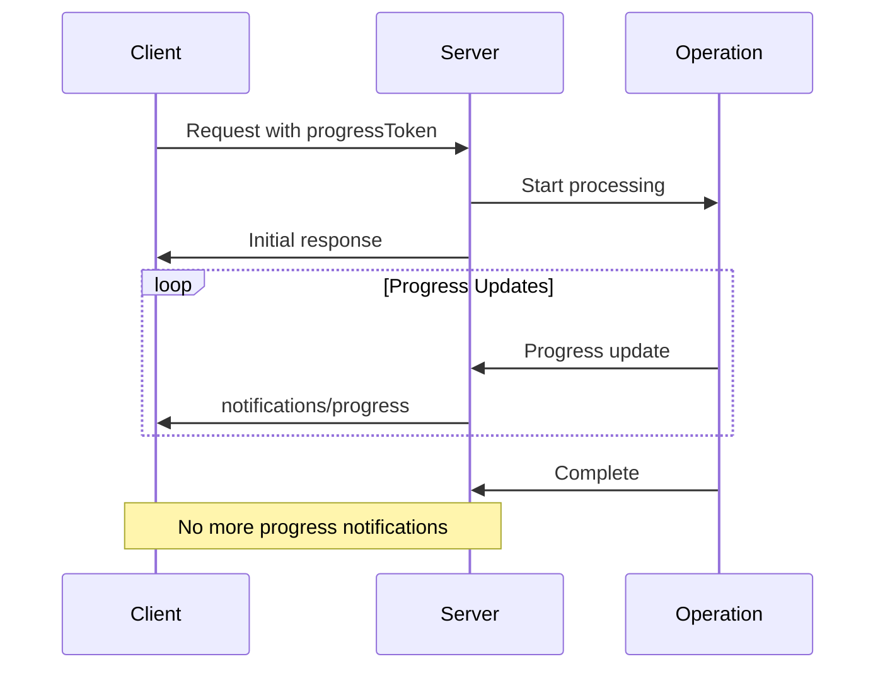

## Protocol Overview

This endpoint provides **three core MCP utility methods** as defined in the MCP 2025-03-26 specification:

1. **`ping`** - Connection health monitoring and latency testing
2. **`notifications/cancelled`** - Request cancellation notifications
3. **`notifications/progress`** - Progress tracking for long-running operations

All methods use **JSON-RPC 2.0** over HTTP with tenant-specific endpoints.

## Prerequisites

1. **Session Initialization**: Call `initialize` method and send `notifications/initialized` notification
2. **Authentication**: Valid OAuth token or PAT with appropriate scopes
3. **Session ID**: Include `Mcp-Session-Id` header from initialization

---

## Ping Method

Test connection health and measure server responsiveness.

### Request Format

<CodeGroup>
```json JSON-RPC Request
{
  "jsonrpc": "2.0",
  "id": "ping-123",
  "method": "ping"
}
```

```bash cURL Example
curl -X POST "https://api.kambrium.com/pipedrive/mcp" \
  -H "Authorization: Bearer your_oauth_token" \
  -H "Content-Type: application/json" \
  -H "Mcp-Session-Id: session_abc123" \
  -d '{
    "jsonrpc": "2.0",
    "id": "health-check",
    "method": "ping"
  }'
```

</CodeGroup>

### Request Parameters

<ParamField path="jsonrpc" type="string" required>
  Must be `"2.0"` (JSON-RPC version)
</ParamField>

<ParamField path="id" type="string" required>
  Unique request identifier
</ParamField>

<ParamField path="method" type="string" required>
  Must be `"ping"`
</ParamField>

### Response Format

<ResponseField name="jsonrpc" type="string" required>
  Always `"2.0"`
</ResponseField>

<ResponseField name="id" type="string" required>
  Matches the request ID
</ResponseField>

<ResponseField name="result" type="object" required>
  Empty object `{}` indicating successful ping
</ResponseField>

### Example Response

<ResponseExample>
```json Ping Success
{
  "jsonrpc": "2.0",
  "id": "ping-123",
  "result": {}
}
```

</ResponseExample>

---

## Cancellation Notifications

Cancel in-progress requests using MCP cancellation notifications.

### Notification Format

<CodeGroup>
```json Cancellation Notification
{
  "jsonrpc": "2.0",
  "method": "notifications/cancelled",
  "params": {
    "requestId": "operation-456",
    "reason": "User requested cancellation"
  }
}
```

```bash cURL Example
curl -X POST "https://api.kambrium.com/pipedrive/mcp" \
  -H "Authorization: Bearer your_oauth_token" \
  -H "Content-Type: application/json" \
  -H "Mcp-Session-Id: session_abc123" \
  -d '{
    "jsonrpc": "2.0",
    "method": "notifications/cancelled",
    "params": {
      "requestId": "long-running-operation",
      "reason": "Timeout exceeded"
    }
  }'
```

</CodeGroup>

### Notification Parameters

<ParamField path="jsonrpc" type="string" required>
  Must be `"2.0"` (JSON-RPC version)
</ParamField>

<ParamField path="method" type="string" required>
  Must be `"notifications/cancelled"`
</ParamField>

<ParamField path="params" type="object" required>
  Cancellation parameters

  <Expandable title="params properties">
    <ParamField path="requestId" type="string" required>
      ID of the request to cancel (must match a previously sent request)
    </ParamField>

    <ParamField path="reason" type="string">
      Optional reason for cancellation (for logging and debugging)
    </ParamField>

  </Expandable>
</ParamField>

### Behavior Requirements

- **No Response**: Notifications do not return responses (fire-and-forget)
- **Race Conditions**: Server handles gracefully if request already completed
- **Unknown Requests**: Server ignores cancellation for unknown request IDs
- **HTTP Status**: Returns `202 Accepted` for valid notifications

### Example Usage

<ResponseExample>
```json Simple Cancellation
{
  "jsonrpc": "2.0",
  "method": "notifications/cancelled",
  "params": {
    "requestId": "tools-call-789"
  }
}
```

```json Detailed Cancellation
{
  "jsonrpc": "2.0",
  "method": "notifications/cancelled",
  "params": {
    "requestId": "resource-read-101",
    "reason": "User cancelled operation"
  }
}
```

</ResponseExample>

---

## Progress Notifications

Track progress of long-running operations using progress tokens.

### Progress Token Setup

Include a `progressToken` in the request metadata to enable progress tracking:

<CodeGroup>
```json Request with Progress Token
{
  "jsonrpc": "2.0",
  "id": "operation-123",
  "method": "tools/call",
  "params": {
    "name": "process_large_dataset",
    "arguments": {
      "dataset_id": "data_2024"
    },
    "_meta": {
      "progressToken": "progress-abc123"
    }
  }
}
```

</CodeGroup>

### Progress Notification Format

The server sends progress updates using the progress token:

<CodeGroup>
```json Progress Notification
{
  "jsonrpc": "2.0",
  "method": "notifications/progress",
  "params": {
    "progressToken": "progress-abc123",
    "progress": 50,
    "total": 100,
    "message": "Processing records..."
  }
}
```

```bash Monitoring Progress
# Server automatically sends progress notifications
# No explicit request needed - just listen for notifications
```

</CodeGroup>

### Progress Parameters

<ParamField path="jsonrpc" type="string" required>
  Must be `"2.0"` (JSON-RPC version)
</ParamField>

<ParamField path="method" type="string" required>
  Must be `"notifications/progress"`
</ParamField>

<ParamField path="params" type="object" required>
  Progress update parameters

  <Expandable title="params properties">
    <ParamField path="progressToken" type="string" required>
      Token from the original request (must match exactly)
    </ParamField>

    <ParamField path="progress" type="number" required>
      Current progress value (must increase with each update)
    </ParamField>

    <ParamField path="total" type="number">
      Total expected value (optional, may be unknown)
    </ParamField>

    <ParamField path="message" type="string">
      Human-readable progress description
    </ParamField>

  </Expandable>
</ParamField>

### Progress Flow



### Example Progress Sequence

<ResponseExample>
```json Progress Start (0%)
{
  "jsonrpc": "2.0",
  "method": "notifications/progress",
  "params": {
    "progressToken": "import-data-456",
    "progress": 0,
    "total": 1000,
    "message": "Starting data import..."
  }
}
```

```json Progress Update (25%)
{
  "jsonrpc": "2.0",
  "method": "notifications/progress",
  "params": {
    "progressToken": "import-data-456",
    "progress": 250,
    "total": 1000,
    "message": "Processed 250 records"
  }
}
```

```json Progress Complete (100%)
{
  "jsonrpc": "2.0",
  "method": "notifications/progress",
  "params": {
    "progressToken": "import-data-456",
    "progress": 1000,
    "total": 1000,
    "message": "Import completed successfully"
  }
}
```

</ResponseExample>

## Error Handling

### Common Error Codes

| Code     | Meaning               | Solution                                      |
| -------- | --------------------- | --------------------------------------------- |
| `-32602` | Invalid params        | Check notification format and required fields |
| `-32001` | Request not found     | Verify request ID exists and is active        |
| `-32000` | Authentication failed | Check OAuth token and session validity        |
| `-32603` | Internal server error | Server-side processing error                  |

### Timeout Handling

- **Ping timeouts**: Consider connection stale after reasonable timeout
- **Cancellation race conditions**: Handle gracefully if request completes before cancellation
- **Progress token cleanup**: Server automatically cleans up completed operations

## Usage Patterns

### Health Monitoring

```javascript
// Regular health checks
setInterval(async () => {
  try {
    const start = Date.now();
    await mcpClient.ping();
    const latency = Date.now() - start;
    console.log(`MCP server healthy (${latency}ms)`);
  } catch (error) {
    console.error("MCP server unhealthy:", error);
  }
}, 30000);
```

### Operation Cancellation

```javascript
// Cancel long-running operation
const operationId = "data-export-123";

// Start operation
const promise = mcpClient.call("export_data", { format: "csv" }, operationId);

// Cancel if needed
setTimeout(() => {
  mcpClient.cancel(operationId, "Operation timeout");
}, 60000);
```

### Progress Tracking

```javascript
// Track operation progress
const progressToken = `progress-${Date.now()}`;

// Listen for progress updates
mcpClient.onProgress(progressToken, (update) => {
  const percent = Math.round((update.progress / update.total) * 100);
  console.log(`${percent}%: ${update.message}`);
});

// Start operation with progress tracking
await mcpClient.call(
  "process_data",
  { dataset: "large_file.csv" },
  `operation-${Date.now()}`,
  { progressToken }
);
```
