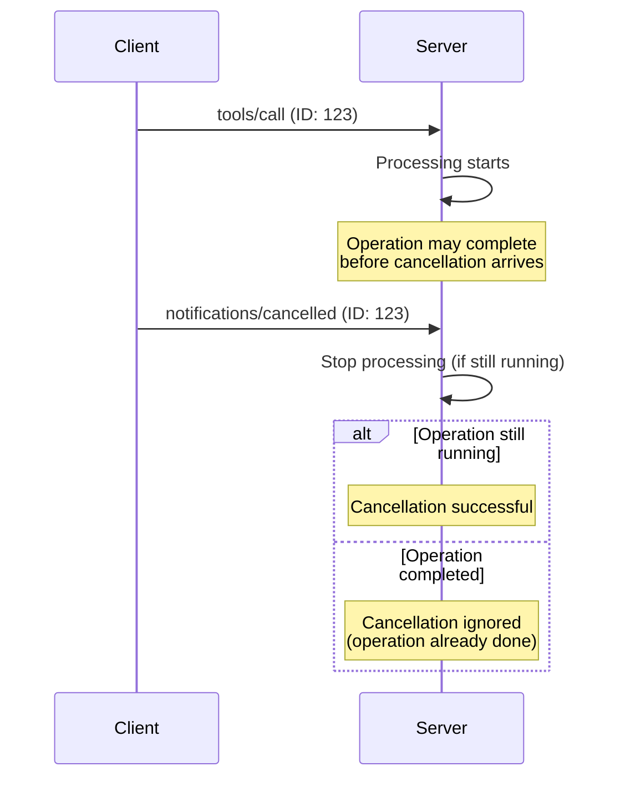

## Protocol Overview

This endpoint provides **three core MCP utility methods** as defined in the MCP 2025-03-26 specification:

1. **`ping`** - Connection health monitoring and latency testing
2. **`notifications/cancelled`** - Request cancellation notifications
3. **`notifications/progress`** - Progress tracking for long-running operations

All methods use **JSON-RPC 2.0** over HTTP with tenant-specific endpoints.

## Prerequisites

1. **Session Initialization**: Call `initialize` method and send `notifications/initialized` notification
2. **Authentication**: Valid OAuth token or PAT with appropriate scopes
3. **Session ID**: Include `Mcp-Session-Id` header from initialization

---

## Ping Method

Test connection health and measure server responsiveness.

### Request Format

<CodeGroup>
```json JSON-RPC Request
{
  "jsonrpc": "2.0",
  "id": "ping-123",
  "method": "ping"
}
```

```bash cURL Example
curl -X POST "https://api.kambrium.com/pipedrive/mcp" \
  -H "Authorization: Bearer your_oauth_token" \
  -H "Content-Type: application/json" \
  -H "Mcp-Session-Id: session_abc123" \
  -d '{
    "jsonrpc": "2.0",
    "id": "health-check",
    "method": "ping"
  }'
```

</CodeGroup>

### Request Parameters

<ParamField path="jsonrpc" type="string" required>
  Must be `"2.0"` (JSON-RPC version)
</ParamField>

<ParamField path="id" type="string" required>
  Unique request identifier
</ParamField>

<ParamField path="method" type="string" required>
  Must be `"ping"`
</ParamField>

### Response Format

<ResponseField name="jsonrpc" type="string" required>
  Always `"2.0"`
</ResponseField>

<ResponseField name="id" type="string" required>
  Matches the request ID
</ResponseField>

<ResponseField name="result" type="object" required>
  Empty object `{}` as per MCP 2025-03-26 specification
</ResponseField>

### Example Response

<ResponseExample>
```json Success Response
{
  "jsonrpc": "2.0",
  "id": "ping-123",
  "result": {}
}
```

```json Error Response
{
  "jsonrpc": "2.0",
  "id": "ping-123",
  "error": {
    "code": -32603,
    "message": "Internal error",
    "data": "Server temporarily unavailable"
  }
}
```

</ResponseExample>

### Rate Limiting

- **Maximum**: 10 pings per minute per client
- **Burst**: Up to 3 consecutive pings allowed
- **Exceeded**: Returns HTTP 429 with rate limit error

---

## Progress Tracking

Track progress of long-running operations through notifications.

### Progress Request

To receive progress updates, include a `progressToken` in the request metadata:

<CodeGroup>
```json Request with Progress Token
{
  "jsonrpc": "2.0",
  "id": "long-operation-1",
  "method": "tools/call",
  "params": {
    "name": "bulk_data_import",
    "arguments": {
      "file_path": "/data/large_dataset.csv"
    },
    "_meta": {
      "progressToken": "import-progress-123"
    }
  }
}
```
</CodeGroup>

### Progress Notifications

The server sends progress notifications during operation:

<CodeGroup>
```json Progress Notification
{
  "jsonrpc": "2.0",
  "method": "notifications/progress",
  "params": {
    "progressToken": "import-progress-123",
    "progress": 450,
    "total": 1000,
    "message": "Processing records 401-450..."
  }
}
```
</CodeGroup>

### Progress Parameters

<ParamField path="progressToken" type="string" required>
  Token from the original request's `_meta.progressToken`
</ParamField>

<ParamField path="progress" type="number" required>
  Current progress value (must increase with each notification)
</ParamField>

<ParamField path="total" type="number">
  Total expected progress value (optional, may be unknown)
</ParamField>

<ParamField path="message" type="string">
  Human-readable progress description
</ParamField>

---

## Request Cancellation

Cancel in-progress operations using cancellation notifications.

### Cancellation Notification

<CodeGroup>
```json Cancellation Request
{
  "jsonrpc": "2.0",
  "method": "notifications/cancelled",
  "params": {
    "requestId": "long-operation-1",
    "reason": "User requested cancellation"
  }
}
```

```bash cURL Example
curl -X POST "https://api.kambrium.com/pipedrive/mcp" \
  -H "Authorization: Bearer your_oauth_token" \
  -H "Content-Type: application/json" \
  -H "Mcp-Session-Id: session_abc123" \
  -d '{
    "jsonrpc": "2.0",
    "method": "notifications/cancelled",
    "params": {
      "requestId": "bulk-import-456",
      "reason": "Operation timeout"
    }
  }'
```

</CodeGroup>

### Cancellation Parameters

<ParamField path="requestId" type="string" required>
  ID of the request to cancel (from original request's `id` field)
</ParamField>

<ParamField path="reason" type="string">
  Optional reason for cancellation (for logging and debugging)
</ParamField>

### Cancellation Behavior

- **Fire-and-forget**: Cancellation notifications don't receive responses
- **Race conditions**: Cancellation may arrive after operation completes
- **Best effort**: Server attempts to stop processing but cannot guarantee immediate cancellation
- **Status**: Returns HTTP 202 (Accepted) for valid cancellation requests

### Race Condition Handling

Due to network latency, cancellation notifications may arrive after operation completion:



Both client and server handle these race conditions gracefully by logging cancellation attempts and ignoring cancellations for completed operations.

## Error Handling

### Common Error Responses

<ResponseExample>
```json Invalid Request ID
{
  "jsonrpc": "2.0",
  "id": "ping-invalid",
  "error": {
    "code": -32600,
    "message": "Invalid Request",
    "data": "Request ID must not be null"
  }
}
```

```json Rate Limit Exceeded
{
  "jsonrpc": "2.0",
  "id": "ping-rate-limited",
  "error": {
    "code": -32000,
    "message": "Request rate limit exceeded",
    "data": {
      "retry_after": 60,
      "limit": 10,
      "remaining": 0
    }
  }
}
```

```json Session Required
{
  "jsonrpc": "2.0",
  "id": "ping-no-session",
  "error": {
    "code": -32602,
    "message": "Invalid params",
    "data": "Session ID required for utility methods"
  }
}
```

</ResponseExample>

### Error Recovery

- **Rate Limiting**: Wait for `retry_after` seconds before sending new requests
- **Session Errors**: Re-initialize session with `initialize` method
- **Connection Errors**: Check network connectivity and authentication tokens

## Implementation Notes

### Performance Considerations

- **Ping Frequency**: Limit to health checks and connection validation
- **Progress Updates**: Server sends updates at reasonable intervals (not every operation)
- **Cancellation Timing**: Send cancellation as soon as user requests it

### Best Practices

- **Ping Usage**: Use for connection health checks, not as keepalive mechanism
- **Progress Tokens**: Use unique, descriptive tokens for easier debugging
- **Cancellation Reasons**: Provide clear reasons for operational transparency
- **Error Handling**: Always handle utility method errors gracefully
