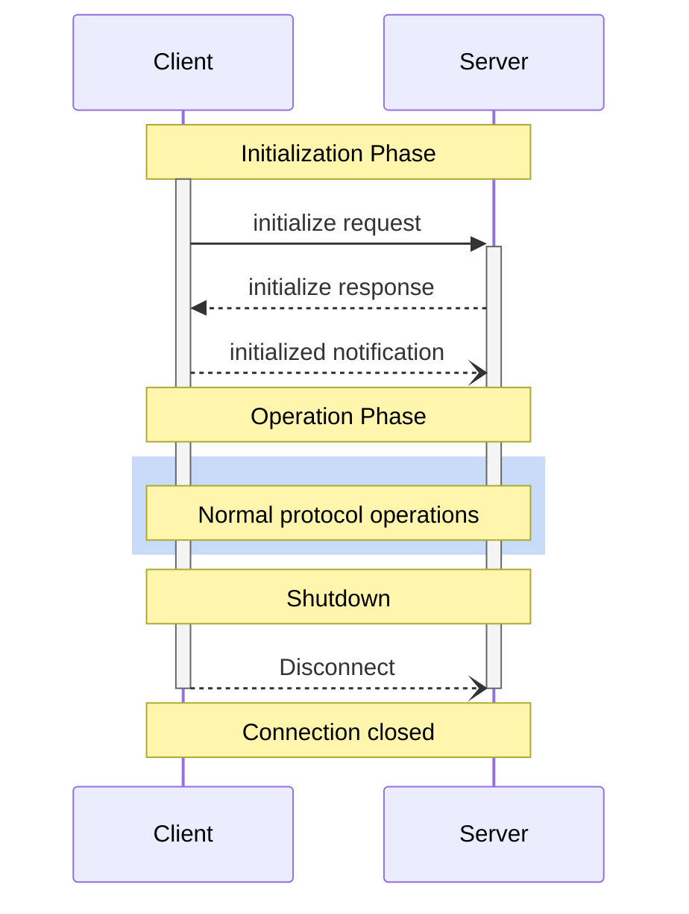

<Info>**Protocol Revision**: 2025-06-18</Info>

The Model Context Protocol (MCP) defines a rigorous lifecycle for client-server connections that ensures proper capability negotiation and state management.

1. **Initialization**: Capability negotiation and protocol version agreement
2. **Operation**: Normal protocol communication
3. **Shutdown**: Graceful termination of the connection



## Lifecycle Phases

### Initialization

The initialization phase **MUST** be the first interaction between client and server. During this phase, the client and server:

- Establish protocol version compatibility
- Exchange and negotiate capabilities
- Share implementation details

The client **MUST** initiate this phase by sending an `initialize` request containing:

- Protocol version supported
- Client capabilities
- Client implementation information

```json
{
  "jsonrpc": "2.0",
  "id": 1,
  "method": "initialize",
  "params": {
    "protocolVersion": "2025-06-18",
    "capabilities": {
      "roots": {
        "listChanged": true
      },
      "sampling": {},
      "elicitation": {}
    },
    "clientInfo": {
      "name": "ExampleClient",
      "title": "Example Client Display Name",
      "version": "1.0.0"
    }
  }
}
```

The server **MUST** respond with its own capabilities and information:

```json
{
  "jsonrpc": "2.0",
  "id": 1,
  "result": {
    "protocolVersion": "2025-06-18",
    "capabilities": {
      "logging": {},
      "prompts": {
        "listChanged": true
      },
      "resources": {
        "subscribe": true,
        "listChanged": true
      },
      "tools": {
        "listChanged": true
      },
      "completions": {}
    },
    "serverInfo": {
      "name": "KambriumMCPServer",
      "title": "Kambrium MCP Server",
      "version": "2.1.0"
    },
    "instructions": "Optional instructions for the client"
  }
}
```

After successful initialization, the client **MUST** send an `initialized` notification to indicate it is ready to begin normal operations:

```json
{
  "jsonrpc": "2.0",
  "method": "notifications/initialized"
}
```

- The client **SHOULD NOT** send requests other than pings before the server has responded to the `initialize` request.
- The server **SHOULD NOT** send requests other than pings and logging before receiving the `initialized` notification.

#### Version Negotiation

In the `initialize` request, the client **MUST** send a protocol version it supports. This **SHOULD** be the _latest_ version supported by the client.

If the server supports the requested protocol version, it **MUST** respond with the same version. Otherwise, the server **MUST** respond with another protocol version it supports. This **SHOULD** be the _latest_ version supported by the server.

If the client does not support the version in the server's response, it **SHOULD** disconnect.

<Note>
  **Kambrium HTTP Implementation**: The client **MUST** include the `MCP-Protocol-Version: <protocol-version>` HTTP header on all subsequent requests to the MCP server.
</Note>

#### Capability Negotiation

Client and server capabilities establish which optional protocol features will be available during the session.

Key capabilities include:

| Category | Capability     | Description                                              |
| -------- | -------------- | -------------------------------------------------------- |
| Client   | `roots`        | Ability to provide filesystem roots                      |
| Client   | `sampling`     | Support for LLM sampling requests                        |
| Client   | `elicitation`  | Support for server elicitation requests                  |
| Client   | `experimental` | Describes support for non-standard experimental features |
| Server   | `prompts`      | Offers prompt templates                                  |
| Server   | `resources`    | Provides readable resources                              |
| Server   | `tools`        | Exposes callable tools                                   |
| Server   | `logging`      | Emits structured log messages                            |
| Server   | `completions`  | Supports argument autocompletion                         |
| Server   | `experimental` | Describes support for non-standard experimental features |

Capability objects can describe sub-capabilities like:

- `listChanged`: Support for list change notifications (for prompts, resources, and tools)
- `subscribe`: Support for subscribing to individual items' changes (resources only)

**Kambrium Implementation:** Based on our test suite (Category 01 - MCP Core Protocol), we implement all standard capabilities with proper negotiation.

### Operation

During the operation phase, the client and server exchange messages according to the negotiated capabilities.

Both parties **MUST**:

- Respect the negotiated protocol version
- Only use capabilities that were successfully negotiated

**Kambrium Implementation:** Our test suite validates operation phase behavior across all categories.

### Shutdown

During the shutdown phase, one side (usually the client) cleanly terminates the protocol connection. No specific shutdown messages are defined—instead, the underlying transport mechanism should be used to signal connection termination:

#### HTTP

For HTTP transports, shutdown is indicated by closing the associated HTTP connection(s).

**Kambrium Implementation:** Our HTTP transport supports graceful shutdown via session termination and connection closure.

## Timeouts

Implementations **SHOULD** establish timeouts for all sent requests, to prevent hung connections and resource exhaustion. When the request has not received a success or error response within the timeout period, the sender **SHOULD** issue a cancellation notification for that request and stop waiting for a response.

**Kambrium Implementation:** Based on our test suite (Category 06 - MCP Utilities), we implement proper timeout handling with cancellation support.

SDKs and other middleware **SHOULD** allow these timeouts to be configured on a per-request basis.

Implementations **MAY** choose to reset the timeout clock when receiving a progress notification corresponding to the request, as this implies that work is actually happening. However, implementations **SHOULD** always enforce a maximum timeout, regardless of progress notifications, to limit the impact of a misbehaving client or server.

## Error Handling

Implementations **SHOULD** be prepared to handle these error cases:

- Protocol version mismatch
- Failure to negotiate required capabilities
- Request timeouts

Example initialization error:

```json
{
  "jsonrpc": "2.0",
  "id": 1,
  "error": {
    "code": -32602,
    "message": "Unsupported protocol version",
    "data": {
      "supported": ["2025-06-18"],
      "requested": "1.0.0"
    }
  }
}
```

**Kambrium Implementation:** Our error handling (verified in test categories) follows JSON-RPC standards with detailed error responses.

## Kambrium Session Management

For HTTP-based clients, Kambrium implements additional session management features:

### Session Headers

```http
POST /pipedrive/mcp HTTP/1.1
Host: api.kambrium.com
Authorization: Bearer oauth_token_here
MCP-Protocol-Version: 2025-06-18
Mcp-Session-Id: session_abc123_xyz789
Content-Type: application/json
```

### Session Lifecycle

1. **Session Creation**: Automatic during initialization with `Mcp-Session-Id` header
2. **Session Validation**: Required on all subsequent requests
3. **Session Termination**: Explicit via DELETE request or timeout

Based on our multi-tenant test suite (Category 08), sessions provide complete tenant isolation and security.

## Next Steps

<CardGroup cols={3}>
  <Card
    title="Transports"
    icon="network-wired"
    href="/api-reference/mcp-protocol/transports"
  />
  <Card
    title="Utilities"
    icon="wrench"
    href="/api-reference/mcp-protocol/utilities"
  />
  <Card
    title="Error Handling"
    icon="triangle-exclamation"
    href="/api-reference/mcp-protocol/error-handling"
  />
</CardGroup>{" "}
