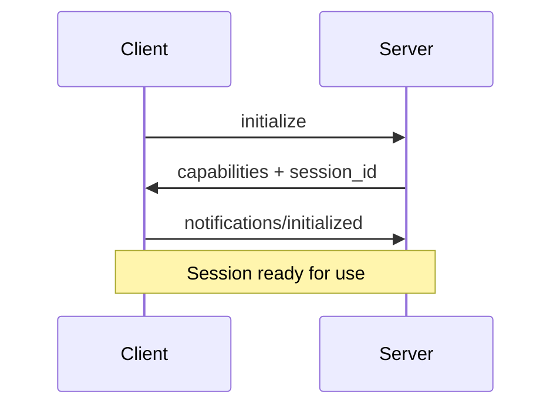
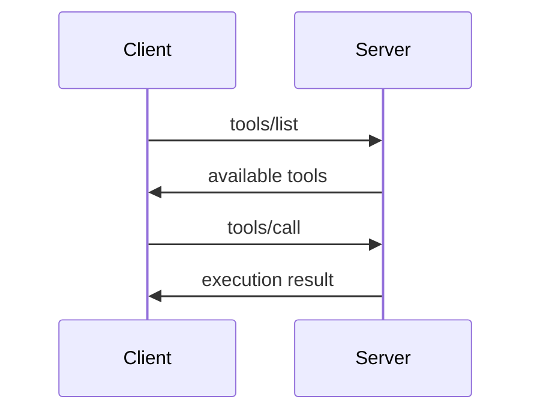

## What is MCP?

The **Model Context Protocol (MCP)** is an open protocol that enables secure, standardized communication between AI systems and external tools, data sources, and services.

MCP provides a **unified interface** for AI agents to:

- Execute tools and functions
- Access real-time data and resources
- Use pre-built prompts and templates
- Maintain secure, authenticated sessions

## Core Architecture

### **JSON-RPC 2.0 Foundation**

MCP is built on **JSON-RPC 2.0**, providing:

- **Single endpoint** per tenant: `POST /{tenant}/mcp`
- **Method-based routing** using the `method` field
- **Request correlation** via unique `id` fields
- **Error handling** with standard JSON-RPC error codes

### **Session-Based Communication**

MCP requires session initialization before use:

1. **Initialize**: Establish capabilities and configuration
2. **Notify**: Send `notifications/initialized` to complete handshake
3. **Use**: Execute methods like `tools/list`, `resources/read`

## Core Primitives

MCP organizes functionality into three main primitives:

| Primitive     | Control Model          | Description                   | Examples                    |
| ------------- | ---------------------- | ----------------------------- | --------------------------- |
| **Tools**     | Model-controlled       | Functions that AI can execute | API calls, data processing  |
| **Resources** | Application-controlled | Data/content for AI context   | Files, databases, documents |
| **Prompts**   | User-controlled        | Templates for AI interactions | Slash commands, workflows   |

### **Tools**

Tools enable AI systems to take actions:

```json
{
  "method": "tools/call",
  "params": {
    "name": "get_weather",
    "arguments": { "location": "New York" }
  }
}
```

### **Resources**

Resources provide contextual data:

```json
{
  "method": "resources/read",
  "params": {
    "uri": "crm://contacts/database"
  }
}
```

### **Prompts**

Prompts offer reusable templates:

```json
{
  "method": "prompts/get",
  "params": {
    "name": "code_review",
    "arguments": { "code": "function hello() {...}" }
  }
}
```

## Protocol Flow

### **1. Session Initialization**



### **2. Method Execution**



## Capabilities Negotiation

Servers advertise supported features during initialization:

```json
{
  "capabilities": {
    "tools": { "listChanged": true },
    "resources": { "subscribe": true, "listChanged": true },
    "prompts": { "listChanged": true },
    "logging": {}
  }
}
```

## Authentication & Security

MCP supports two authentication methods:

- **OAuth 2.1**: Standard OAuth flow with scopes
- **Personal Access Tokens (PATs)**: Direct token-based access

Required scopes:

- `mcp.read` - List tools, resources, prompts
- `mcp.tools.execute` - Execute tools
- `mcp.resources.read` - Read resource content

## Error Handling

MCP uses standard JSON-RPC error codes:

| Code     | Meaning        | Usage                          |
| -------- | -------------- | ------------------------------ |
| `-32000` | Server error   | Authentication, session issues |
| `-32001` | Not found      | Unknown tool/resource/prompt   |
| `-32602` | Invalid params | Malformed request parameters   |
| `-32603` | Internal error | Server-side processing errors  |

## Next Steps

- **Learn about** [Session Management](./session-management)
- **Understand** [Error Handling](./error-handling)
- **Explore** specific methods:
  - [Tools](../mcp-methods/tools-list)
  - [Resources](../mcp-methods/resources-list)
  - [Prompts](../mcp-methods/prompts-list)
