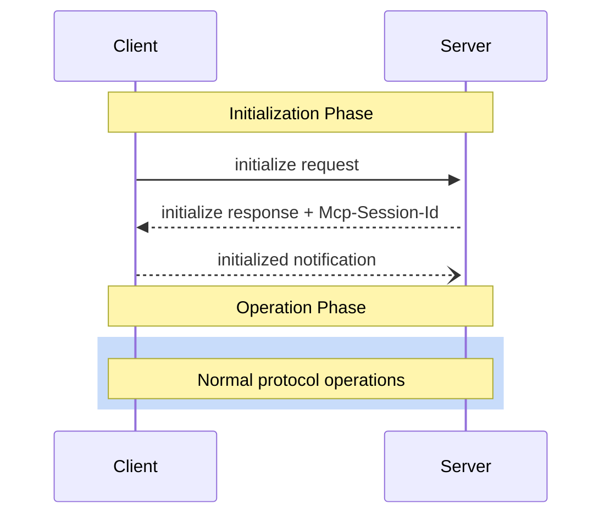
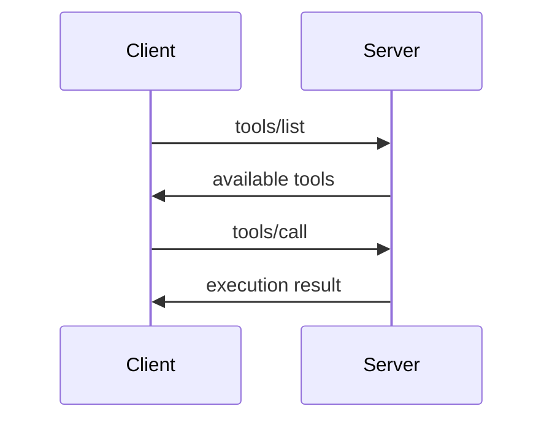

<Info>**Protocol Revision**: 2025-06-18</Info>

[Model Context Protocol](https://modelcontextprotocol.io) (MCP) is an open protocol that enables seamless integration between LLM applications and external data sources and tools. Whether you're building an AI-powered IDE, enhancing a chat interface, or creating custom AI workflows, MCP provides a standardized way to connect LLMs with the context they need.

## What is MCP?

MCP provides a standardized way for applications to:

- Share contextual information with language models
- Expose tools and capabilities to AI systems
- Build composable integrations and workflows

The protocol uses [JSON-RPC](https://www.jsonrpc.org/) 2.0 messages to establish communication between:

- **Hosts**: LLM applications that initiate connections
- **Clients**: Connectors within the host application
- **Servers**: Services that provide context and capabilities

MCP takes some inspiration from the [Language Server Protocol](https://microsoft.github.io/language-server-protocol/), which standardizes how to add support for programming languages across a whole ecosystem of development tools. In a similar way, MCP standardizes how to integrate additional context and tools into the ecosystem of AI applications.

## Key Details

### Base Protocol

- [JSON-RPC](https://www.jsonrpc.org/) 2.0 message format
- Stateful connections with session management
- Server and client capability negotiation
- UTF-8 encoded messages

### Server Features

Servers offer the following features to clients:

- **Resources**: Context and data, for the user or the AI model to use
- **Prompts**: Templated messages and workflows for users
- **Tools**: Functions for the AI model to execute

### Client Features

Clients may offer the following features to servers:

- **Sampling**: Server-initiated agentic behaviors and recursive LLM interactions
- **Roots**: Server-initiated inquiries into URI or filesystem boundaries to operate in
- **Elicitation**: Server-initiated requests for additional information from users

### Additional Utilities

- **Ping**: Connection health monitoring
- **Progress**: Progress tracking for long-running operations
- **Cancellation**: Request cancellation mechanism
- **Logging**: Structured log messages
- **Pagination**: Cursor-based pagination for large result sets

## Kambrium Implementation

Kambrium's MCP server implements the complete MCP 2025-06-18 specification with the following specific features:

### Transport Support

- **HTTP Transport**: Complete Streamable HTTP implementation with POST/GET endpoints
- **Multi-tenant Architecture**: Single server serves multiple tenants via `/{tenant}/mcp` routing
- **Session Management**: Full `Mcp-Session-Id` header support for stateful connections

### Authentication & Security

- **OAuth 2.1**: Complete OAuth flow with AWS Cognito integration
- **Personal Access Tokens (PATs)**: Direct token-based authentication
- **Security Compliance**: DNS rebinding protection, origin validation, input sanitization

### Core Capabilities

Based on our test suite, Kambrium implements:

- ✅ **JSON-RPC 2.0**: Complete protocol compliance including batch requests
- ✅ **Lifecycle Management**: Initialization, capability negotiation, session management
- ✅ **Tools**: Database-driven dynamic tools with user permissions
- ✅ **Resources**: Static and dynamic resources with subscription support
- ✅ **Prompts**: Template system with argument substitution
- ✅ **Completions**: Argument autocompletion functionality
- ✅ **Utilities**: Ping, progress tracking, cancellation, logging

## Protocol Flow

### 1. Session Initialization



### 2. Capability Negotiation

During initialization, the server advertises its supported capabilities:

```json
{
  "capabilities": {
    "tools": { "listChanged": true },
    "resources": { "subscribe": true, "listChanged": true },
    "prompts": { "listChanged": true },
    "logging": {},
    "completions": {}
  }
}
```

### 3. Method Execution



## Security and Trust & Safety

MCP enables powerful capabilities through arbitrary data access and code execution paths. Kambrium implements these security principles:

### Key Principles

1. **User Consent and Control**

   - Users must explicitly consent to and understand all data access and operations
   - OAuth-based permission system for tool access
   - Clear authentication and authorization flows

2. **Data Privacy**

   - Multi-tenant isolation ensures data separation
   - OAuth scopes control access to specific capabilities
   - User data protected with appropriate access controls

3. **Tool Safety**
   - Database-driven tool permissions per user
   - OAuth scopes required for tool execution (`mcp.tools.execute`)
   - Input validation and sanitization for all tool parameters

## Next Steps

Explore the detailed protocol components:

<CardGroup cols={3}>
  <Card
    title="Base Protocol"
    icon="code"
    href="/api-reference/mcp-protocol/base-protocol"
  />
  <Card
    title="Lifecycle"
    icon="refresh"
    href="/api-reference/mcp-protocol/lifecycle"
  />
  <Card
    title="Transports"
    icon="network-wired"
    href="/api-reference/mcp-protocol/transports"
  />
</CardGroup>

<CardGroup cols={2}>
  <Card
    title="Utilities"
    icon="wrench"
    href="/api-reference/mcp-protocol/utilities"
  />
  <Card
    title="Error Handling"
    icon="triangle-exclamation"
    href="/api-reference/mcp-protocol/error-handling"
  />
</CardGroup>{" "}
