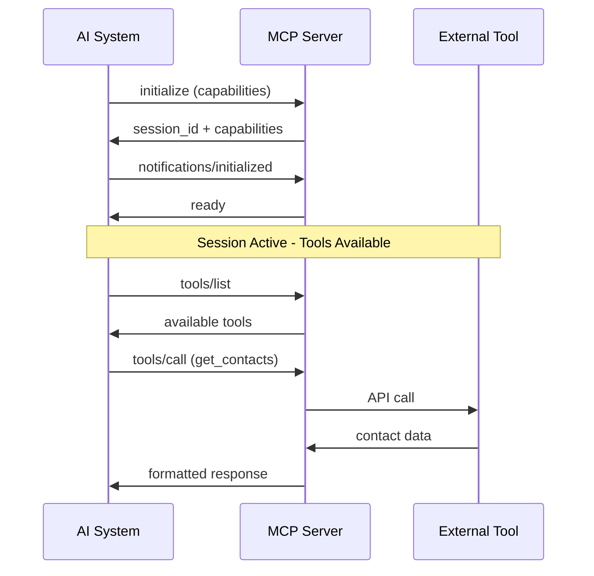

## What is MCP?

The **Model Context Protocol (MCP)** is an open protocol that enables secure, standardized communication between AI systems and external tools, data sources, and services.

MCP provides a **unified interface** for AI agents to:

- Execute tools and functions
- Access real-time data and resources
- Use pre-built prompts and templates
- Maintain secure, authenticated sessions

## Why MCP?

### **The Problem**

Before MCP, each AI system needed custom integrations for every external service:

- **Fragmented APIs** - Different formats for every service
- **Security complexity** - Multiple authentication methods
- **Maintenance overhead** - Constant updates for API changes
- **Limited reusability** - Integrations locked to specific AI systems

### **The Solution**

MCP provides a **standardized bridge** between AI systems and external tools:

- **Unified protocol** - Same interface for all services
- **Secure authentication** - OAuth 2.1 and PAT token support
- **Session management** - Reliable connection handling
- **Tool discovery** - Dynamic capability detection

## Core Concepts

### **1. JSON-RPC 2.0 Foundation**

MCP is built on **JSON-RPC 2.0**, providing:

- **Structured communication** with request/response patterns
- **Error handling** with standardized error codes
- **Bidirectional messaging** for real-time updates
- **Protocol versioning** for backward compatibility

### **2. Session-Based Communication**

Every MCP interaction requires an active session:



### **3. Multi-Tenant Architecture**

MCP supports multiple isolated environments:

- **Tenant-specific endpoints**: `POST /{tenant}/mcp`
- **Isolated data access** per tenant
- **Separate authentication** contexts
- **Resource namespacing** by tenant

### **4. Capability Discovery**

MCP servers advertise their capabilities:

- **Tools** - Functions that can be executed
- **Resources** - Data that can be accessed
- **Prompts** - Templates for AI interactions
- **Utilities** - Health checks and configuration

## Protocol Features

### **Security First**

- **OAuth 2.1 Client Credentials** flow
- **Personal Access Tokens (PATs)** for service accounts
- **Scope-based permissions** (`mcp.read`, `mcp.write`, `mcp.tools.execute`)
- **Session isolation** between tenants

### **Real-Time Communication**

- **Notifications** for resource changes
- **Progress updates** for long-running operations
- **Error propagation** with detailed context
- **Connection health monitoring**

### **Extensible Design**

- **Custom tool registration** for new capabilities
- **Resource type flexibility** (JSON, CSV, PDF, images)
- **Prompt parameterization** for dynamic content
- **Plugin architecture** for specialized integrations

## MCP vs Traditional APIs

| Aspect                 | Traditional APIs     | MCP Protocol                 |
| ---------------------- | -------------------- | ---------------------------- |
| **Interface**          | Service-specific     | Standardized JSON-RPC        |
| **Discovery**          | Static documentation | Dynamic capability detection |
| **Authentication**     | Various methods      | Unified OAuth/PAT            |
| **Session Management** | Stateless            | Session-based with lifecycle |
| **Error Handling**     | HTTP status codes    | Structured JSON-RPC errors   |
| **Real-time Updates**  | Webhooks/polling     | Built-in notifications       |
| **AI Integration**     | Custom adapters      | Native AI-friendly format    |

## Use Cases

### **CRM Integration**

```json
{
  "method": "tools/call",
  "params": {
    "name": "get_contacts",
    "arguments": {
      "limit": 10,
      "filter": "recent"
    }
  }
}
```

### **Document Access**

```json
{
  "method": "resources/read",
  "params": {
    "uri": "file://reports/sales_data.csv"
  }
}
```

### **AI Prompt Templates**

```json
{
  "method": "prompts/get",
  "params": {
    "name": "analyze_performance",
    "arguments": {
      "time_period": "Q1 2024",
      "metric": "revenue"
    }
  }
}
```

## Implementation Requirements

To implement MCP, servers must support:

1. **Core Protocol**

   - JSON-RPC 2.0 messaging
   - Session initialization and management
   - Error handling and status reporting

2. **Authentication**

   - OAuth 2.1 client credentials flow
   - PAT token validation
   - Scope-based access control

3. **Required Methods**

   - `initialize` - Session establishment
   - `ping` - Health monitoring
   - At least one of: `tools/*`, `resources/*`, or `prompts/*`

4. **Optional Features**
   - Notifications and subscriptions
   - Completion suggestions
   - Logging configuration
   - Custom tool registration

## Next Steps

Ready to implement MCP? Continue with:

- **[Session Management](./session-management)** - Learn the session lifecycle
- **[Authentication](../authentication/mcp-server)** - Set up secure access
- **[MCP Methods](../mcp-methods/tools-list)** - Explore available capabilities
