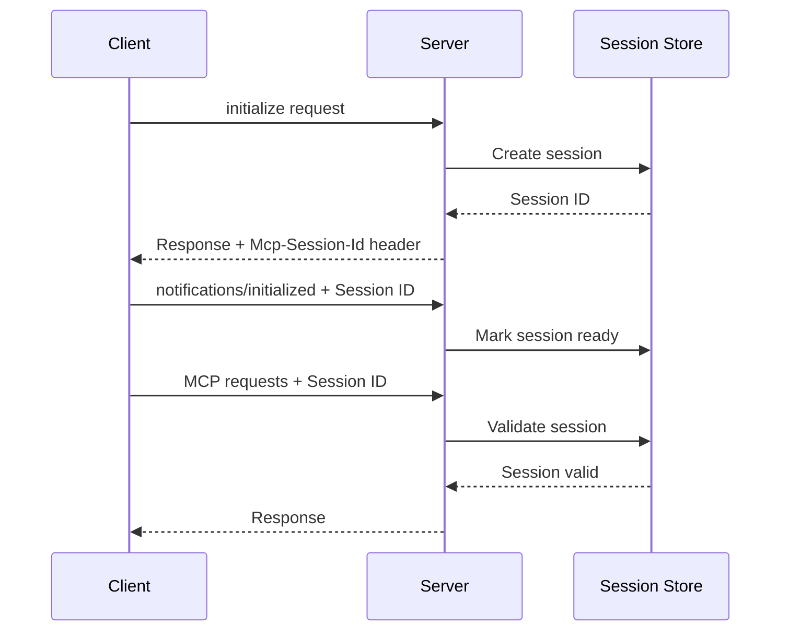

## Architecture Overview

Our MCP server implements the Model Context Protocol (MCP) 2025-03-26 specification over HTTP transport with JSON-RPC 2.0 messaging. The implementation focuses on production-ready features for enterprise AI tool integration.

### Core Components

- **HTTP Transport**: RESTful endpoints with JSON-RPC 2.0 over HTTPS
- **Session Management**: Stateful sessions with unique session IDs and lifecycle tracking
- **Authentication**: OAuth 2.1 and Personal Access Token (PAT) support
- **Protocol Features**: Tools, resources, prompts, and utility methods

## Protocol Features

### Server Capabilities

Our implementation supports these MCP server features:

| Feature       | Implementation | Description                                         |
| ------------- | -------------- | --------------------------------------------------- |
| **Tools**     | ✅ Full        | Dynamic tool execution with OAuth-filtered access   |
| **Resources** | ✅ Full        | URI-based resource access with subscription support |
| **Prompts**   | ✅ Full        | Template-based prompts with argument substitution   |
| **Utilities** | ✅ Full        | Ping, progress tracking, and request cancellation   |

### Transport Layer

**HTTP/HTTPS Only**: Our implementation uses HTTP transport exclusively:

- **Endpoints**: Tenant-specific paths (`/{tenant}/mcp`)
- **Methods**: POST for JSON-RPC, GET for SSE streaming
- **Headers**: Standard HTTP headers plus MCP-specific session tracking
- **Security**: TLS encryption, OAuth 2.1 authentication, CORS support

### Session Architecture

**Stateful Sessions**: Unlike basic MCP implementations, we maintain session state:



## Message Format

### JSON-RPC 2.0 Compliance

All messages follow JSON-RPC 2.0 specification with MCP extensions:

**Request Format:**

```json
{
  "jsonrpc": "2.0",
  "id": "unique-request-id",
  "method": "mcp_method_name",
  "params": {
    "method_specific_parameters": "value"
  }
}
```

**Response Format:**

```json
{
  "jsonrpc": "2.0",
  "id": "unique-request-id",
  "result": {
    "method_specific_result": "value"
  }
}
```

**Error Format:**

```json
{
  "jsonrpc": "2.0",
  "id": "unique-request-id",
  "error": {
    "code": -32602,
    "message": "Invalid params",
    "data": {
      "details": "Additional error context"
    }
  }
}
```

### MCP-Specific Extensions

**Session Headers:**

- `Mcp-Session-Id`: Session identifier (required after initialization)

**Request ID Requirements:**

- Must be unique within a session
- Cannot be null (unlike base JSON-RPC)
- String or number format supported

**Batch Requests:**

- Full JSON-RPC 2.0 batch support
- Mixed requests and notifications in single batch
- Responses only for requests (not notifications)

## Authentication Integration

### OAuth 2.1 Flow

Standard OAuth 2.1 with PKCE for secure authentication:

1. **Authorization**: Client redirects to OAuth provider
2. **Token Exchange**: PKCE-protected token exchange
3. **MCP Access**: Bearer token in Authorization header
4. **Session Binding**: Token validated per session

### Personal Access Tokens (PAT)

Long-lived tokens for programmatic access:

1. **Token Generation**: User creates PAT through management interface
2. **JWT Format**: Signed JWT tokens with expiration
3. **Scope Validation**: Fine-grained permission control
4. **Session Integration**: PAT validated per MCP session

## Error Handling

### Standard Error Codes

| Code     | Name             | Description        | Recovery                 |
| -------- | ---------------- | ------------------ | ------------------------ |
| `-32700` | Parse error      | Invalid JSON       | Fix request format       |
| `-32600` | Invalid Request  | Invalid JSON-RPC   | Check required fields    |
| `-32601` | Method not found | Unknown MCP method | Verify method name       |
| `-32602` | Invalid params   | Bad parameters     | Check parameter format   |
| `-32603` | Internal error   | Server error       | Retry or contact support |

### MCP-Specific Errors

| Code     | Name               | Description      | Recovery               |
| -------- | ------------------ | ---------------- | ---------------------- |
| `-32000` | Authentication     | Auth failure     | Refresh token          |
| `-32001` | Resource not found | Missing resource | Verify resource exists |
| `-32002` | Tool not found     | Unknown tool     | Check available tools  |

## Performance Features

### Rate Limiting

Configurable rate limits per endpoint and client:

- **MCP POST**: 60 requests/minute (default)
- **MCP GET**: 30 requests/minute (streaming)
- **Health**: 120 requests/minute
- **Ping**: 10 requests/minute

### Caching

Intelligent caching for performance:

- **Tool Definitions**: Cached with invalidation on changes
- **Resource Metadata**: TTL-based caching
- **Session State**: In-memory with cleanup

### Monitoring

Built-in observability features:

- **Health Endpoints**: `/health`, `/ready`, `/metrics`
- **Request Tracking**: Unique request IDs with timing
- **Error Logging**: Structured error logging with context
- **Metrics**: Prometheus-compatible metrics export

## Security Features

### Input Validation

Comprehensive input sanitization:

- **JSON Schema Validation**: Request parameter validation
- **SQL Injection Prevention**: Parameterized queries
- **XSS Protection**: Output encoding
- **Size Limits**: Request and response size limits

### Access Control

Multi-layered access control:

- **Authentication**: OAuth 2.1 or PAT required
- **Authorization**: Scope-based permission checking
- **Tool Filtering**: User-specific tool access
- **Resource Isolation**: Tenant-based resource isolation

## Implementation Notes

### HTTP Transport Specifics

**Connection Management:**

- Stateless HTTP requests with session tracking
- Connection pooling for performance
- Graceful shutdown with request completion

**Content Negotiation:**

- `application/json` for JSON-RPC requests
- `text/event-stream` for SSE streaming
- Gzip compression support

**CORS Support:**

- Configurable allowed origins
- Preflight request handling
- Credential support for authenticated requests

### Scalability Considerations

**Horizontal Scaling:**

- Stateless request processing
- Shared session storage (Redis/Database)
- Load balancer compatibility

**Resource Management:**

- Connection pooling
- Request timeout handling
- Memory usage monitoring

This implementation provides a production-ready MCP server suitable for enterprise AI tool integration with comprehensive security, monitoring, and scalability features.
