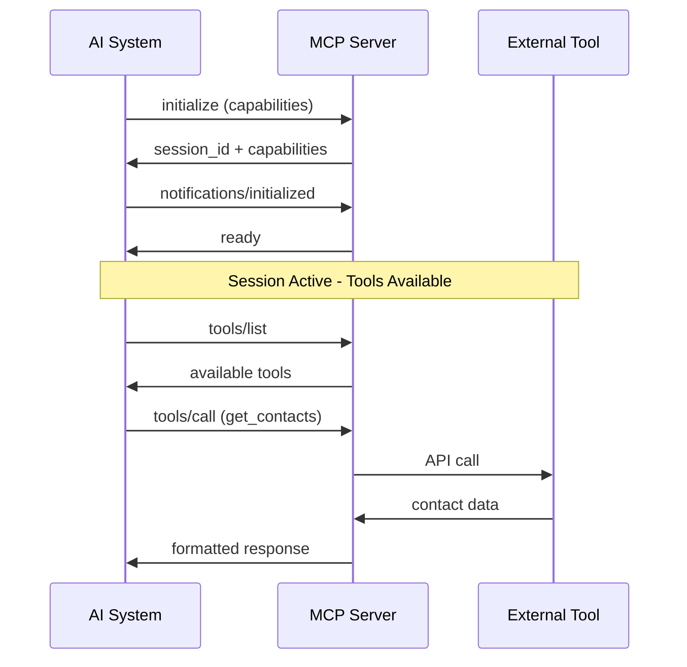

## What is MCP?

The **Model Context Protocol (MCP)** is an open protocol that enables secure, standardized communication between AI systems and external tools, data sources, and services.

MCP provides a **unified interface** for AI agents to:

- Execute tools and functions
- Access real-time data and resources
- Use pre-built prompts and templates
- Maintain secure, authenticated sessions

## Core Architecture

### **JSON-RPC 2.0 Foundation**

MCP is built on **JSON-RPC 2.0**, providing:

- **Structured communication** with request/response patterns
- **Error handling** with standardized error codes
- **Bidirectional messaging** for real-time updates
- **Protocol versioning** for backward compatibility

### **Session-Based Communication**

Every MCP interaction requires an active session:



### **Multi-Tenant Architecture**

MCP supports multiple isolated environments:

- **Tenant-specific endpoints**: `POST /{tenant}/mcp`
- **Isolated data access** per tenant
- **Separate authentication** contexts
- **Resource namespacing** by tenant

## Protocol Components

### **Server Features**

- **Tools** - Functions that can be executed by AI systems
- **Resources** - Data that can be accessed and read
- **Prompts** - Templates for AI interactions

### **Client Features**

- **Sampling** - Control over AI model behavior
- **Root Lists** - Directory structure management

### **Utilities**

- **Ping** - Connection health monitoring
- **Cancellation** - Request cancellation notifications
- **Progress** - Progress tracking for long-running operations

### **Cross-Cutting Features**

- **Logging** - Configurable server logging levels
- **Completion** - Argument completion suggestions
- **Pagination** - Handling large result sets

## Message Types

### **Requests**

Standard JSON-RPC requests with required ID:

```json
{
  "jsonrpc": "2.0",
  "id": "request-123",
  "method": "tools/list",
  "params": {}
}
```

### **Responses**

Standard JSON-RPC responses:

```json
{
  "jsonrpc": "2.0",
  "id": "request-123",
  "result": {
    "tools": [...]
  }
}
```

### **Notifications**

One-way messages without responses:

```json
{
  "jsonrpc": "2.0",
  "method": "notifications/progress",
  "params": {
    "progressToken": "abc123",
    "progress": 50,
    "total": 100
  }
}
```

## Implementation Requirements

### **Required Components**

1. **Base Protocol** - JSON-RPC 2.0 messaging
2. **Lifecycle Management** - Session initialization and management
3. **Authentication** - OAuth 2.1 or PAT token support
4. **At least one feature** - Tools, Resources, or Prompts

### **Optional Components**

- Server features (tools, resources, prompts)
- Client features (sampling, root lists)
- Utilities (ping, cancellation, progress)
- Cross-cutting features (logging, completion, pagination)

## Security Model

- **OAuth 2.1 Client Credentials** flow for applications
- **Personal Access Tokens (PATs)** for service accounts
- **Scope-based permissions** (`mcp.read`, `mcp.write`, `mcp.tools.execute`)
- **Session isolation** between tenants
- **Request validation** and sanitization

## Error Handling

MCP uses standard JSON-RPC error codes:

| Code     | Meaning               | Description                    |
| -------- | --------------------- | ------------------------------ |
| `-32700` | Parse error           | Invalid JSON                   |
| `-32600` | Invalid request       | Invalid JSON-RPC structure     |
| `-32601` | Method not found      | Unknown method                 |
| `-32602` | Invalid params        | Invalid method parameters      |
| `-32603` | Internal error        | Server-side processing error   |
| `-32000` | Authentication failed | Invalid or missing credentials |
| `-32001` | Resource not found    | Requested resource unavailable |
| `-32002` | Rate limit exceeded   | Too many requests              |

## Next Steps

Ready to implement MCP? Continue with:

- [Session Management](./session-management) - Learn about MCP session lifecycle
- [Error Handling](./error-handling) - Understand error codes and handling
- [Authentication](../authentication/introduction) - Set up secure access
