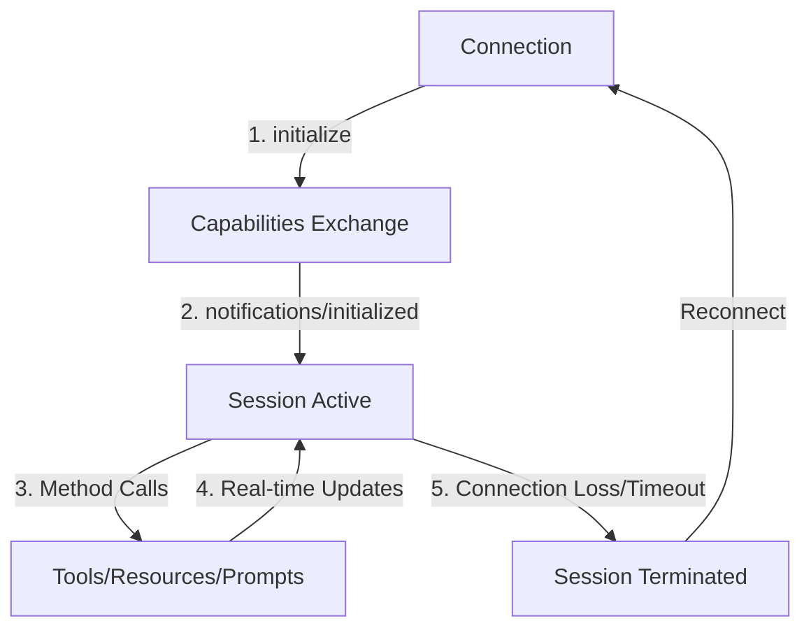

## Session Lifecycle

MCP uses **session-based communication** to ensure reliable, stateful interactions between AI systems and external tools. Every MCP interaction requires an active session.



## Session Initialization

### **Step 1: Initialize Request**

The AI system starts by sending an `initialize` request to establish capabilities and get a session ID.

<CodeGroup>
```json Initialize Request
{
  "jsonrpc": "2.0",
  "id": "init-123",
  "method": "initialize",
  "params": {
    "protocolVersion": "2025-03-26",
    "capabilities": {
      "roots": {
        "listChanged": true
      },
      "sampling": {}
    },
    "clientInfo": {
      "name": "KambriumAI",
      "version": "1.0.0"
    }
  }
}
```

```bash cURL Example
curl -X POST "https://api.kambrium.com/pipedrive/mcp" \
  -H "Authorization: Bearer your_oauth_token" \
  -H "Content-Type: application/json" \
  -d '{
    "jsonrpc": "2.0",
    "id": "session-init",
    "method": "initialize",
    "params": {
      "protocolVersion": "2025-03-26",
      "capabilities": {
        "roots": {
          "listChanged": true
        }
      },
      "clientInfo": {
        "name": "MyAISystem",
        "version": "2.1.0"
      }
    }
  }'
```

</CodeGroup>

### **Step 2: Initialize Response**

The MCP server responds with its capabilities and a session identifier.

<ResponseExample>
```json Initialize Response
{
  "jsonrpc": "2.0",
  "id": "init-123",
  "result": {
    "protocolVersion": "2025-03-26",
    "capabilities": {
      "logging": {},
      "tools": {
        "listChanged": true
      },
      "resources": {
        "subscribe": true,
        "listChanged": true
      },
      "prompts": {
        "listChanged": true
      }
    },
    "serverInfo": {
      "name": "Pipedrive MCP Server",
      "version": "1.2.1"
    },
    "instructions": "Ready to serve Pipedrive CRM data and tools."
  }
}
```

</ResponseExample>

**Important**: The response includes a `Mcp-Session-Id` header that must be included in all subsequent requests:

```
Mcp-Session-Id: session_abc123_xyz789
```

### **Step 3: Notification Confirmation**

The AI system must send a confirmation notification to activate the session.

<CodeGroup>
```json Initialized Notification
{
  "jsonrpc": "2.0",
  "method": "notifications/initialized"
}
```

```bash cURL Example
curl -X POST "https://api.kambrium.com/pipedrive/mcp" \
  -H "Authorization: Bearer your_oauth_token" \
  -H "Content-Type: application/json" \
  -H "Mcp-Session-Id: session_abc123_xyz789" \
  -d '{
    "jsonrpc": "2.0",
    "method": "notifications/initialized"
  }'
```

</CodeGroup>

**Note**: This notification has no `id` field because it expects no response.

## Session Requirements

### **Headers**

Every request after initialization must include:

- **`Authorization`**: OAuth token or PAT
- **`Mcp-Session-Id`**: Session identifier from initialize response
- **`Content-Type`**: `application/json`

### **Session Validation**

The MCP server validates every request:

1. **Valid session ID** exists and hasn't expired
2. **Authentication token** is valid and has required scopes
3. **Protocol compliance** with JSON-RPC 2.0 format

### **Session Timeout**

Sessions automatically expire after periods of inactivity:

- **Default timeout**: 30 minutes
- **Configurable** per server implementation
- **Ping method** can be used to keep sessions alive

## Capability Negotiation

### **Client Capabilities**

The AI system declares what it can handle:

| Capability          | Description                | Example                 |
| ------------------- | -------------------------- | ----------------------- |
| `roots.listChanged` | Can handle root changes    | Directory notifications |
| `sampling`          | Supports sampling requests | Model sampling          |

### **Server Capabilities**

The MCP server declares what it provides:

| Capability  | Description       | Required Methods                   |
| ----------- | ----------------- | ---------------------------------- |
| `tools`     | Tool execution    | `tools/list`, `tools/call`         |
| `resources` | Data access       | `resources/list`, `resources/read` |
| `prompts`   | Template system   | `prompts/list`, `prompts/get`      |
| `logging`   | Log configuration | `logging/setLevel`                 |

### **Capability-Based Access**

Only advertised capabilities are available:

```json
// If server doesn't advertise "tools" capability
{
  "error": {
    "code": -32601,
    "message": "Method not found: tools/list"
  }
}
```

## Session Monitoring

### **Health Checks**

Use the `ping` method to monitor session health:

<CodeGroup>
```json Ping Request
{
  "jsonrpc": "2.0",
  "id": "health-check",
  "method": "ping"
}
```

```javascript Health Monitoring
// Regular health checks in JavaScript
setInterval(async () => {
  try {
    await mcpClient.ping();
    console.log("Session healthy");
  } catch (error) {
    console.log("Session unhealthy, reconnecting...");
    await mcpClient.reconnect();
  }
}, 30000); // Every 30 seconds
```

</CodeGroup>

### **Connection Recovery**

If a session fails:

1. **Detect failure** (timeout, network error, invalid session)
2. **Reinitialize** with same authentication
3. **Restore state** (subscriptions, logging level)
4. **Resume operations**

## Error Handling

### **Session Errors**

Common session-related errors:

| Error Code | Meaning                 | Solution                     |
| ---------- | ----------------------- | ---------------------------- |
| `-32000`   | Session not initialized | Call `initialize` first      |
| `-32001`   | Invalid session         | Reinitialize with valid auth |
| `-32002`   | Session expired         | Start new session            |
| `-32003`   | Authentication failed   | Check token validity         |

### **Recovery Strategies**

```javascript
async function handleSessionError(error) {
  switch (error.code) {
    case -32000: // Not initialized
    case -32001: // Invalid session
    case -32002: // Expired
      await reinitializeSession();
      break;
    case -32003: // Auth failed
      await refreshAuthToken();
      await reinitializeSession();
      break;
    default:
      throw error; // Unrecoverable
  }
}
```

## Best Practices

### **Session Management**

1. **Initialize once** per connection
2. **Reuse sessions** for multiple operations
3. **Monitor health** with regular pings
4. **Handle timeouts** gracefully
5. **Clean reconnection** on failures

### **Performance Optimization**

```javascript
class MCPSession {
  constructor() {
    this.sessionId = null;
    this.capabilities = null;
    this.lastActivity = Date.now();
  }

  async ensureSession() {
    if (!this.sessionId || this.isExpired()) {
      await this.initialize();
    }
    this.lastActivity = Date.now();
  }

  isExpired() {
    return Date.now() - this.lastActivity > 25 * 60 * 1000; // 25 min
  }
}
```

### **Error Recovery**

```javascript
async function robustMCPCall(method, params) {
  let retries = 3;
  while (retries > 0) {
    try {
      await session.ensureSession();
      return await mcpClient.call(method, params);
    } catch (error) {
      if (isSessionError(error) && retries > 1) {
        await session.initialize();
        retries--;
        continue;
      }
      throw error;
    }
  }
}
```

## Advanced Features

### **Subscriptions**

Subscribe to real-time updates:

```json
{
  "jsonrpc": "2.0",
  "id": "sub-1",
  "method": "resources/subscribe",
  "params": {
    "uri": "crm://contacts/*"
  }
}
```

### **Notifications**

Receive server-initiated messages:

```json
{
  "jsonrpc": "2.0",
  "method": "notifications/resources/updated",
  "params": {
    "uri": "crm://contacts/123",
    "operation": "modified"
  }
}
```

## Next Steps

Now that you understand session management:

- **[MCP Methods](../mcp-methods/tools-list)** - Learn about available capabilities
- **[Error Handling](./error-handling)** - Master error recovery strategies
- **[Authentication](../authentication/mcp-server)** - Secure your sessions
