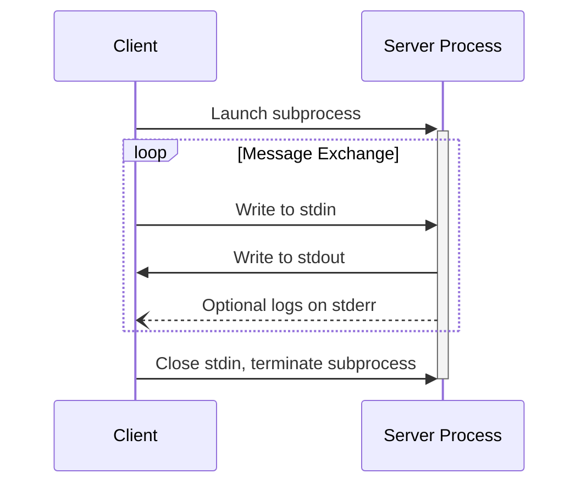
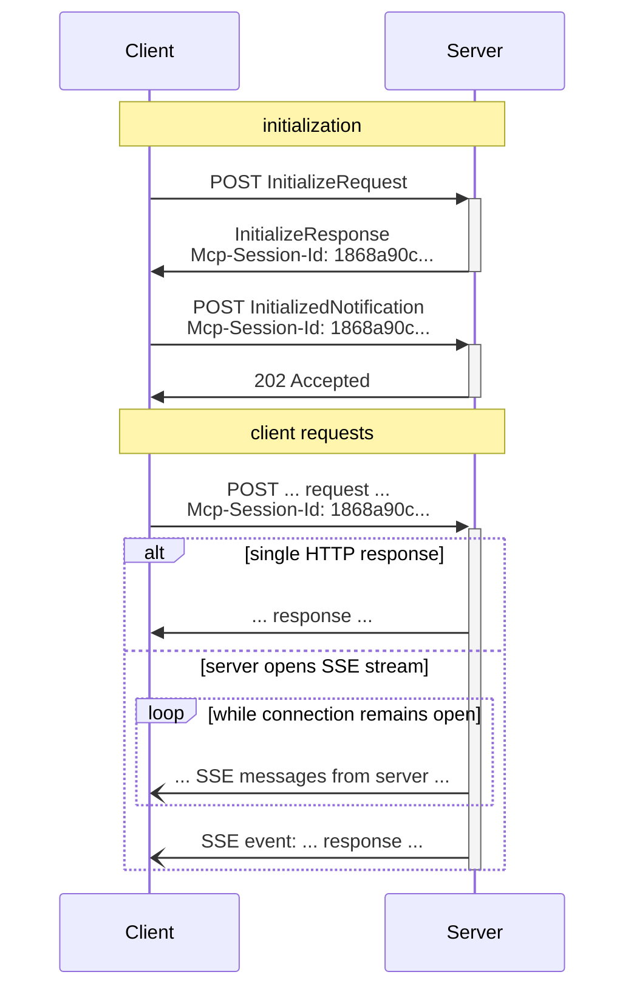

<Info>**Protocol Revision**: 2025-06-18</Info>

MCP uses JSON-RPC to encode messages. JSON-RPC messages **MUST** be UTF-8 encoded.

The protocol currently defines two standard transport mechanisms for client-server communication:

1. [stdio](#stdio), communication over standard in and standard out
2. [Streamable HTTP](#streamable-http)

Clients **SHOULD** support stdio whenever possible.

It is also possible for clients and servers to implement [custom transports](#custom-transports) in a pluggable fashion.

## stdio

In the **stdio** transport:

- The client launches the MCP server as a subprocess.
- The server reads JSON-RPC messages from its standard input (`stdin`) and sends messages to its standard output (`stdout`).
- Messages are individual JSON-RPC requests, notifications, or responses.
- Messages are delimited by newlines, and **MUST NOT** contain embedded newlines.
- The server **MAY** write UTF-8 strings to its standard error (`stderr`) for logging purposes. Clients **MAY** capture, forward, or ignore this logging.
- The server **MUST NOT** write anything to its `stdout` that is not a valid MCP message.
- The client **MUST NOT** write anything to the server's `stdin` that is not a valid MCP message.



<Note>
  **Kambrium Note**: Kambrium focuses on HTTP transport for production
  deployments. stdio transport is not currently implemented in our
  infrastructure.
</Note>

## Streamable HTTP

<Info>
  This replaces the HTTP+SSE transport from protocol version 2024-11-05.
</Info>

In the **Streamable HTTP** transport, the server operates as an independent process that can handle multiple client connections. This transport uses HTTP POST and GET requests. Server can optionally make use of [Server-Sent Events](https://en.wikipedia.org/wiki/Server-sent_events) (SSE) to stream multiple server messages.

The server **MUST** provide a single HTTP endpoint path (hereafter referred to as the **MCP endpoint**) that supports both POST and GET methods.

**Kambrium Implementation**: Our MCP endpoint follows the pattern `/{tenant}/mcp` (e.g., `https://api.kambrium.com/pipedrive/mcp`).

#### Security Warning

When implementing Streamable HTTP transport:

1. Servers **MUST** validate the `Origin` header on all incoming connections to prevent DNS rebinding attacks
2. When running locally, servers **SHOULD** bind only to localhost (127.0.0.1) rather than all network interfaces (0.0.0.0)
3. Servers **SHOULD** implement proper authentication for all connections

**Kambrium Security**: We implement all recommended security measures including origin validation, OAuth/PAT authentication, and secure HTTPS-only endpoints.

### Sending Messages to the Server

Every JSON-RPC message sent from the client **MUST** be a new HTTP POST request to the MCP endpoint.

1. The client **MUST** use HTTP POST to send JSON-RPC messages to the MCP endpoint.
2. The client **MUST** include an `Accept` header, listing both `application/json` and `text/event-stream` as supported content types.
3. The body of the POST request **MUST** be a single JSON-RPC _request_, _notification_, or _response_.
4. If the input is a JSON-RPC _response_ or _notification_:
   - If the server accepts the input, the server **MUST** return HTTP status code 202 Accepted with no body.
   - If the server cannot accept the input, it **MUST** return an HTTP error status code (e.g., 400 Bad Request).
5. If the input is a JSON-RPC _request_, the server **MUST** either return `Content-Type: text/event-stream`, to initiate an SSE stream, or `Content-Type: application/json`, to return one JSON object.

**Example Kambrium Request:**

```http
POST /pipedrive/mcp HTTP/1.1
Host: api.kambrium.com
Authorization: Bearer oauth_token_here
MCP-Protocol-Version: 2025-06-18
Mcp-Session-Id: session_abc123_xyz789
Content-Type: application/json
Accept: application/json, text/event-stream

{
  "jsonrpc": "2.0",
  "id": "request-123",
  "method": "tools/list",
  "params": {
    "cursor": "eyJwYWdlIjogMn0="
  }
}
```

### Listening for Messages from the Server

1. The client **MAY** issue an HTTP GET to the MCP endpoint to open an SSE stream.
2. The client **MUST** include an `Accept` header, listing `text/event-stream` as a supported content type.
3. The server **MUST** either return `Content-Type: text/event-stream` or return HTTP 405 Method Not Allowed.

**Kambrium Implementation**: Based on our test suite (Category 05 - HTTP Transport), we support both POST and GET methods with proper SSE streaming.

### Session Management

An MCP "session" consists of logically related interactions between a client and a server, beginning with the initialization phase.

1. A server using the Streamable HTTP transport **MAY** assign a session ID at initialization time, by including it in an `Mcp-Session-Id` header on the HTTP response containing the `InitializeResult`.
2. If an `Mcp-Session-Id` is returned by the server during initialization, clients **MUST** include it in the `Mcp-Session-Id` header on all subsequent HTTP requests.
3. The server **MAY** terminate the session at any time, after which it **MUST** respond to requests containing that session ID with HTTP 404 Not Found.
4. When a client receives HTTP 404 in response to a request containing an `Mcp-Session-Id`, it **MUST** start a new session by sending a new `InitializeRequest` without a session ID attached.

**Kambrium Session Flow:**



### Protocol Version Header

The client **MUST** include the `MCP-Protocol-Version: <protocol-version>` HTTP header on all requests to the MCP server.

**Example:** `MCP-Protocol-Version: 2025-06-18`

The protocol version sent by the client **SHOULD** be the one negotiated during initialization.

For backwards compatibility, if the server does _not_ receive an `MCP-Protocol-Version` header, the server **SHOULD** assume protocol version `2025-06-18`.

If the server receives a request with an invalid or unsupported `MCP-Protocol-Version`, it **MUST** respond with `400 Bad Request`.

## Kambrium HTTP Implementation

Based on our comprehensive test suite, Kambrium implements:

### HTTP Transport Features (Category 05)

- ✅ **HTTP Methods**: POST for requests, GET for SSE streaming, OPTIONS for CORS
- ✅ **Headers**: Proper Content-Type, Authorization, and MCP-specific headers
- ✅ **Status Codes**: HTTP compliance with 200, 202, 400, 401, 404, 500
- ✅ **Streaming**: Server-Sent Events support for real-time communication

### Multi-tenant Architecture (Category 08)

- ✅ **Tenant Routing**: `/{tenant}/mcp` endpoint structure
- ✅ **Isolation**: Complete data separation between tenants
- ✅ **Configuration**: Per-tenant server configuration and capabilities

### Security Features (Categories 07, 09)

- ✅ **OAuth 2.1**: Complete authentication flow with scopes
- ✅ **PAT Authentication**: Personal Access Token support
- ✅ **Input Validation**: Comprehensive parameter validation and sanitization
- ✅ **Access Control**: User-specific tool and resource permissions

### Performance & Reliability (Categories 10, 11)

- ✅ **Concurrent Requests**: Multi-threaded request handling
- ✅ **Load Testing**: Validated under high load conditions
- ✅ **Rate Limiting**: Built-in throttling and protection
- ✅ **Health Monitoring**: Comprehensive health checks and metrics

## Required Headers

For all Kambrium HTTP requests:

| Header                 | Required | Description                       | Example                               |
| ---------------------- | -------- | --------------------------------- | ------------------------------------- |
| `Authorization`        | Yes      | OAuth token or PAT authentication | `Bearer oauth_abc123`                 |
| `MCP-Protocol-Version` | Yes      | MCP protocol version              | `2025-06-18`                          |
| `Mcp-Session-Id`       | Yes\*    | Session identifier (\*after init) | `session_abc123_xyz789`               |
| `Content-Type`         | Yes      | Request content type              | `application/json`                    |
| `Accept`               | Yes      | Accepted response types           | `application/json, text/event-stream` |

## Custom Transports

Clients and servers **MAY** implement additional custom transport mechanisms to suit their specific needs. The protocol is transport-agnostic and can be implemented over any communication channel that supports bidirectional message exchange.

Implementers who choose to support custom transports **MUST** ensure they preserve the JSON-RPC message format and lifecycle requirements defined by MCP.

## Next Steps

<CardGroup cols={2}>
  <Card
    title="Utilities"
    icon="wrench"
    href="/api-reference/mcp-protocol/utilities"
  />
  <Card
    title="Error Handling"
    icon="triangle-exclamation"
    href="/api-reference/mcp-protocol/error-handling"
  />
</CardGroup>{" "}
