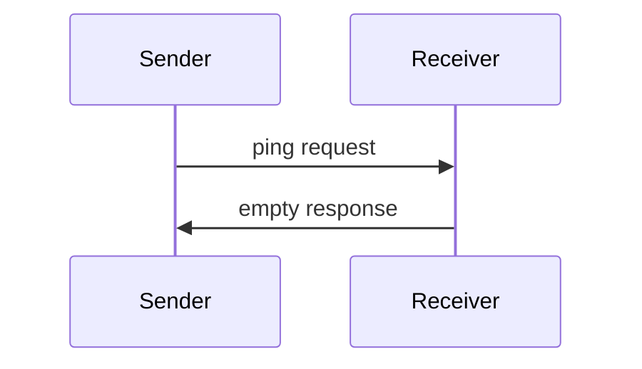
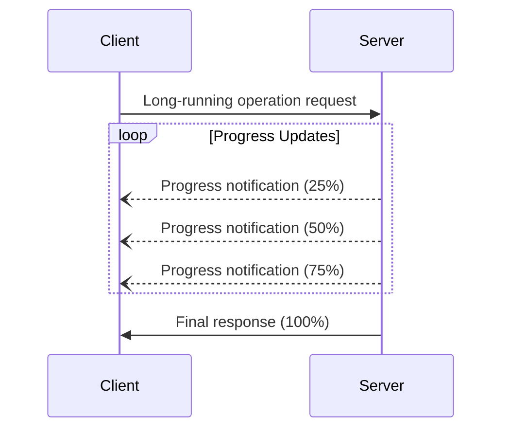
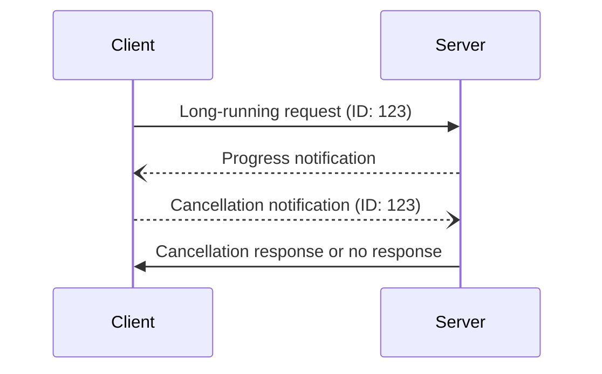
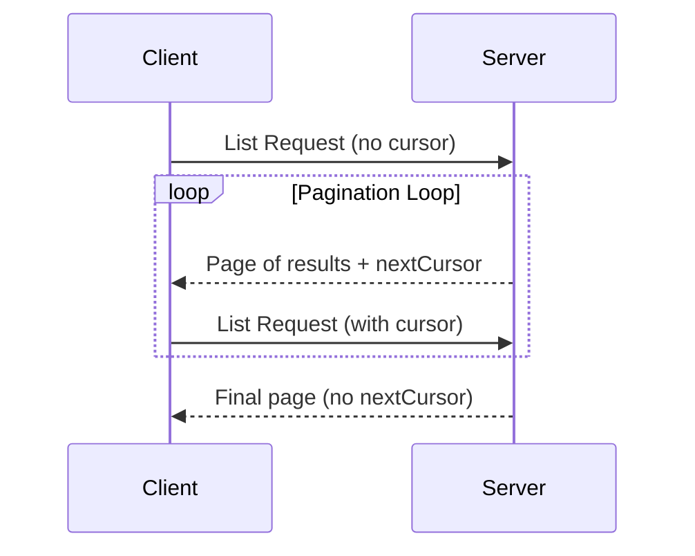

<Info>**Protocol Revision**: 2025-06-18</Info>

The Model Context Protocol includes several utility features that support robust client-server communication. These utilities are designed to improve reliability, provide feedback, and enable efficient data transfer.

## Ping

The ping functionality allows either party to verify that their counterpart is still responsive and the connection is alive.

### Overview

The ping functionality is implemented through a simple request/response pattern. Either the client or server can initiate a ping by sending a `ping` request.

### Message Format

A ping request is a standard JSON-RPC request with no parameters:

```json
{
  "jsonrpc": "2.0",
  "id": "ping-123",
  "method": "ping"
}
```

### Behavior Requirements

1. The receiver **MUST** respond promptly with an empty response:

```json
{
  "jsonrpc": "2.0",
  "id": "ping-123",
  "result": {}
}
```

2. If no response is received within a reasonable timeout period, the sender **MAY**:
   - Consider the connection stale
   - Terminate the connection
   - Attempt reconnection procedures

**Kambrium Implementation**: Based on our test suite (Category 06 - MCP Utilities), we implement ping with configurable timeouts and automatic connection health monitoring.



## Progress Tracking

Progress notifications allow servers to provide real-time updates on long-running operations.

### Progress Notification

Servers can send progress notifications to inform clients about the status of ongoing operations:

```json
{
  "jsonrpc": "2.0",
  "method": "notifications/progress",
  "params": {
    "progressToken": "operation-456",
    "progress": 50,
    "total": 100
  }
}
```

### Parameters

- `progressToken`: Unique identifier for the operation
- `progress`: Current progress value
- `total` (optional): Total expected value

**Kambrium Implementation**: Our progress tracking (Category 06 tests) supports:

- ✅ **Token-based Operations**: Unique progress tokens for operation correlation
- ✅ **Real-time Updates**: Live progress notifications via SSE
- ✅ **Completion Tracking**: Progress from 0 to total with status updates



## Cancellation

The cancellation mechanism allows clients to abort ongoing operations.

### Cancellation Notification

Clients can send cancellation notifications to request that the server abort a specific operation:

```json
{
  "jsonrpc": "2.0",
  "method": "notifications/cancelled",
  "params": {
    "requestId": "request-123",
    "reason": "User cancelled operation"
  }
}
```

### Parameters

- `requestId`: The ID of the request to cancel
- `reason` (optional): Human-readable reason for cancellation

### Server Behavior

Upon receiving a cancellation notification, servers **SHOULD**:

- Stop processing the specified request
- Clean up any associated resources
- **MAY** still send a response indicating cancellation

**Kambrium Implementation**: Our cancellation support (Category 06 tests) provides:

- ✅ **Request Correlation**: Cancel operations by request ID
- ✅ **Resource Cleanup**: Proper cleanup of cancelled operations
- ✅ **Graceful Handling**: Safe operation cancellation without data corruption



## Pagination

MCP supports cursor-based pagination for list operations that may return large result sets.

### Pagination Model

Pagination in MCP uses an opaque cursor-based approach, instead of numbered pages.

- The **cursor** is an opaque string token, representing a position in the result set
- **Page size** is determined by the server, and clients **MUST NOT** assume a fixed page size

### Response Format

Pagination starts when the server sends a **response** that includes:

- The current page of results
- An optional `nextCursor` field if more results exist

```json
{
  "jsonrpc": "2.0",
  "id": "123",
  "result": {
    "tools": [
      {
        "name": "get_weather",
        "description": "Get weather information"
      }
    ],
    "nextCursor": "eyJwYWdlIjogM30="
  }
}
```

### Request Format

After receiving a cursor, the client can _continue_ paginating by issuing a request including that cursor:

```json
{
  "jsonrpc": "2.0",
  "method": "tools/list",
  "params": {
    "cursor": "eyJwYWdlIjogMn0="
  }
}
```

**Kambrium Implementation**: Based on our tests, pagination is supported for:

- `tools/list` - List available tools
- `resources/list` - List available resources
- `prompts/list` - List available prompts



### Implementation Guidelines

1. Servers **SHOULD**:

   - Provide stable cursors
   - Handle invalid cursors gracefully

2. Clients **SHOULD**:

   - Treat a missing `nextCursor` as the end of results
   - Support both paginated and non-paginated flows

3. Clients **MUST** treat cursors as opaque tokens:
   - Don't make assumptions about cursor format
   - Don't attempt to parse or modify cursors
   - Don't persist cursors across sessions

### Error Handling

Invalid cursors **SHOULD** result in an error with code -32602 (Invalid params).

## Kambrium Utility Implementation

Based on our comprehensive test suite, Kambrium implements all MCP utilities:

### Test Coverage (Category 06 - MCP Utilities)

- ✅ **Ping Tests**: Connection health monitoring and timeout handling
- ✅ **Progress Tests**: Real-time progress tracking for long operations
- ✅ **Cancellation Tests**: Request cancellation and resource cleanup

### Additional Features

- **Multi-tenant Support**: All utilities work within tenant-isolated environments
- **Authentication Integration**: Utilities respect OAuth/PAT authentication
- **Performance Optimized**: Efficient handling under high load conditions
- **Error Recovery**: Robust error handling and recovery mechanisms

## Next Steps

<CardGroup cols={2}>
  <Card
    title="Error Handling"
    icon="triangle-exclamation"
    href="/api-reference/mcp-protocol/error-handling"
  />
  <Card
    title="MCP Methods"
    icon="code"
    href="/api-reference/mcp-methods/tools-list"
  />
</CardGroup>
