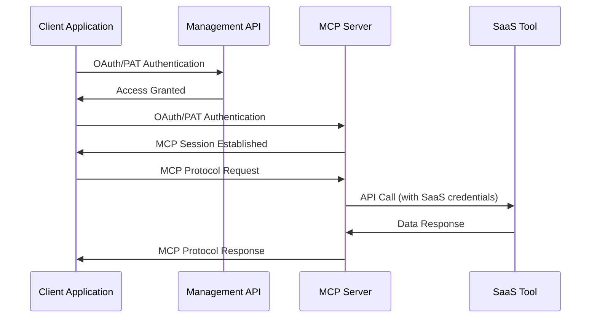

Kambrium uses a three-layer authentication architecture to secure access from users to SaaS tools through our MCP platform.

## Three Authentication Layers

### Layer 1: Management API

**Purpose:** Setting up and managing MCP server connections  
**Authentication:** OAuth 2.1 Client Credentials OR Personal Access Tokens (PATs)

### Layer 2: MCP Server Runtime

**Purpose:** Execute MCP protocol operations and access tools, resources, and prompts  
**Authentication:** OAuth 2.1 Client Credentials OR Personal Access Tokens (PATs)

### Layer 3: SaaS Tool Connections

**Purpose:** Connect MCP servers to external APIs (Pipedrive, Gmail, etc.)  
**Authentication:** API keys OR SaaS provider OAuth flows

## Authentication Methods

### OAuth 2.1 Client Credentials

Standard OAuth flow for production applications:

- **Client credentials** (client_id/client_secret) obtained from web UI
- **Short-lived tokens** with automatic expiration
- **Token refresh** capability for continuous access
- **Recommended** for production server-to-server applications

### Personal Access Tokens (PATs)

Long-lived tokens for development and scripting:

- **Non-expiring JWT tokens** generated in web UI
- **Copy-paste experience** like traditional API keys
- **Platform-generated tokens** - no external dependencies
- **Perfect for** development, scripting, CI/CD pipelines

## Authentication Flow

## Key Principles

- **Consistent authentication:** OAuth 2.1 and PATs work identically for Management API and MCP Server access
- **Token choice:** OAuth for production environments, PATs for development workflows
- **SaaS integration:** Users provide API keys or complete OAuth flows with SaaS providers
- **MCP compliance:** All MCP server access follows MCP protocol standards
- **Secure by design:** Each layer enforces authentication independently
