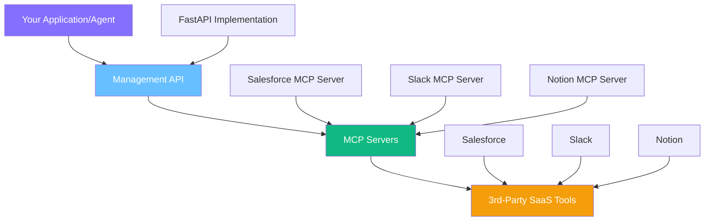

## Platform Overview

Kambrium provides **Model Context Protocol (MCP) Servers** that enable customers to connect AI agents to third-party SaaS tools. Our architecture is designed to be fully compliant with the MCP specification, leveraging a unified OAuth 2.1 framework for secure access across different use cases.

### What is MCP?

The **Model Context Protocol** is an open standard that allows AI agents to securely connect to external data sources and tools. Instead of building custom integrations for each SaaS tool, MCP provides a standardized way for AI applications to interact with your business systems.

**Why use Kambrium vs. direct API integration?**

- **Standardized protocol** - One integration pattern for all tools
- **Built-in security** - OAuth 2.1 compliance with proper scoping
- **Agent-optimized** - Designed specifically for AI agent interactions
- **Simplified management** - Central dashboard for all connections

---

## Three-Layer Architecture

The Kambrium platform operates through three distinct layers that work together:

<CardGroup cols={1}>
  <Card title="Layer 1: Management API" icon="cog">
    **Purpose:** High-level administrative API for managing the lifecycle of MCP Server connections
    
    **Technology:** FastAPI implementation that sits above individual MCP Servers
    
    **Available Operations:**
    - Get all available MCP Server integrations
    - Create new MCP Server connections  
    - Get own MCP Server connections
    - Delete own MCP Server connections
    - Edit own MCP Server connections
    
    **Authentication:** OAuth 2.1 with JWT tokens in `Authorization: Bearer <token>` header
  </Card>
  
  <Card title="Layer 2: MCP Servers" icon="server">
    **Purpose:** Protocol-compliant servers that provide standardized access to specific SaaS tools
    
    **Function:** Each MCP Server handles the specific API implementation for one SaaS tool (Slack, Salesforce, Notion, etc.) and exposes it through the standardized MCP protocol
    
    **Lifecycle:** Managed through the Management API
    
    **Compliance:** Fully MCP specification compliant
  </Card>
  
  <Card title="Layer 3: 3rd-Party SaaS Tools" icon="plug">
    **Purpose:** Your existing business applications and data sources
    
    **Examples:** Salesforce, Slack, Notion, GitHub, Google Workspace, HubSpot, etc.
    
    **Authentication:** Handled transparently through OAuth flows or API keys
    
    **Access:** Abstracted through the MCP protocol in Layer 2
  </Card>
</CardGroup>

---

## Authentication Methods

The platform supports multiple authentication methods depending on your use case:

<CardGroup cols={2}>
  <Card title="Personal Access Tokens (PATs)" icon="key">
    **Best for:** Development, scripting, CI/CD pipelines, internal tools
    **Characteristics:** - Long-lived tokens (configurable expiration) - Simple
    "copy-paste" experience - OAuth 2.1 compliant JWT tokens - Perfect for
    automation and testing
  </Card>

  <Card title="OAuth 2.1 Client Credentials" icon="shield-check">
    **Best for:** Production applications, server-to-server communication
    **Characteristics:** - Short-lived tokens with automatic refresh - Industry
    standard security - Programmatic token generation - Suitable for
    high-security environments
  </Card>
</CardGroup>

---

## Getting Started

Ready to integrate with Kambrium? Here's your roadmap:

<CardGroup cols={2}>
  <Card
    title="Management API Authentication"
    href="/authentication/management-api"
    icon="key"
  >
    Learn how to authenticate with our Management API using PATs or OAuth 2.1
  </Card>

  <Card
    title="MCP Server Setup"
    href="/authentication/mcp-server"
    icon="server"
  >
    Understand how MCP Servers work and how to use them in your applications
  </Card>

  <Card
    title="SaaS Integrations"
    href="/authentication/integrations"
    icon="plug"
  >
    Connect your first SaaS tool and handle OAuth flows
  </Card>

  <Card title="Complete Guide" href="/guides/mcp-setup" icon="rocket">
    Follow our step-by-step integration tutorial
  </Card>
</CardGroup>

---

## Base URLs

When working with the Kambrium platform, you'll interact with these endpoints:

- **Management API:** `https://api.kambrium.com`
- **OAuth Server:** `https://auth.kambrium.com`
- **MCP Servers:** `https://mcp.kambrium.com`

---

## Next Steps

<CardGroup cols={2}>
  <Card
    title="Management API Authentication"
    href="/authentication/management-api"
    icon="arrow-right"
  >
    Start with Management API authentication to create and manage your MCP
    servers
  </Card>

  <Card title="Dashboard" href="https://app.kambrium.com" icon="external-link">
    Access the Kambrium web interface to get started visually
  </Card>
</CardGroup>

<Note>
  Need help getting started? Join our [Discord
  community](https://discord.gg/kambrium) or contact
  [support@kambrium.com](mailto:support@kambrium.com).
</Note>{" "}
