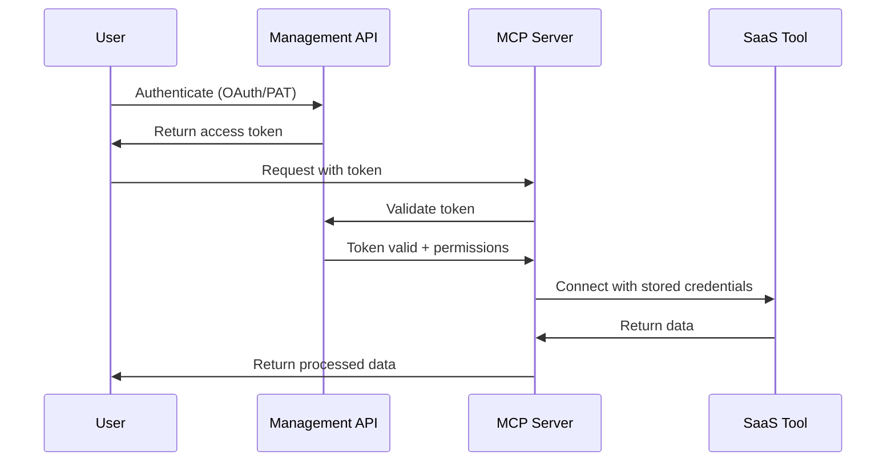

# Authentication Overview

Kambrium uses a three-layer authentication architecture to secure access from users to SaaS tools through our platform.

## Three Authentication Layers

### Layer 1: Management API

**Purpose:** Control and configure MCP servers and their integrations  
**Users:** Developers and administrators  
**Methods:** OAuth 2.1 with Personal Access Tokens (PATs)

### Layer 2: MCP Server Runtime

**Purpose:** Execute MCP protocol operations and manage tool access  
**Users:** MCP clients and applications  
**Methods:** JWT tokens with scoped permissions

### Layer 3: SaaS Tool Connections

**Purpose:** Connect to external APIs (Pipedrive, Gmail, etc.)  
**Users:** End users through MCP servers  
**Methods:** API keys or OAuth flows

## Authentication Methods

### OAuth 2.1

Modern OAuth implementation with enhanced security features:

- **Client credentials flow** for server-to-server authentication
- **PKCE support** for enhanced security
- **JWT tokens** with structured claims and scopes
- **Automatic token refresh** for seamless operation

### Personal Access Tokens (PATs)

Long-lived tokens for programmatic access:

- **Scoped permissions** for granular access control
- **Context-specific** tokens for different use cases
- **Secure storage** with encrypted payloads
- **Easy revocation** for security management

## Authentication Flow

## Security Features

- **JWT token validation** with signature verification
- **Scope-based authorization** for fine-grained access control
- **Token expiration** and automatic refresh
- **Secure credential storage** for SaaS integrations
- **Request validation** and rate limiting
