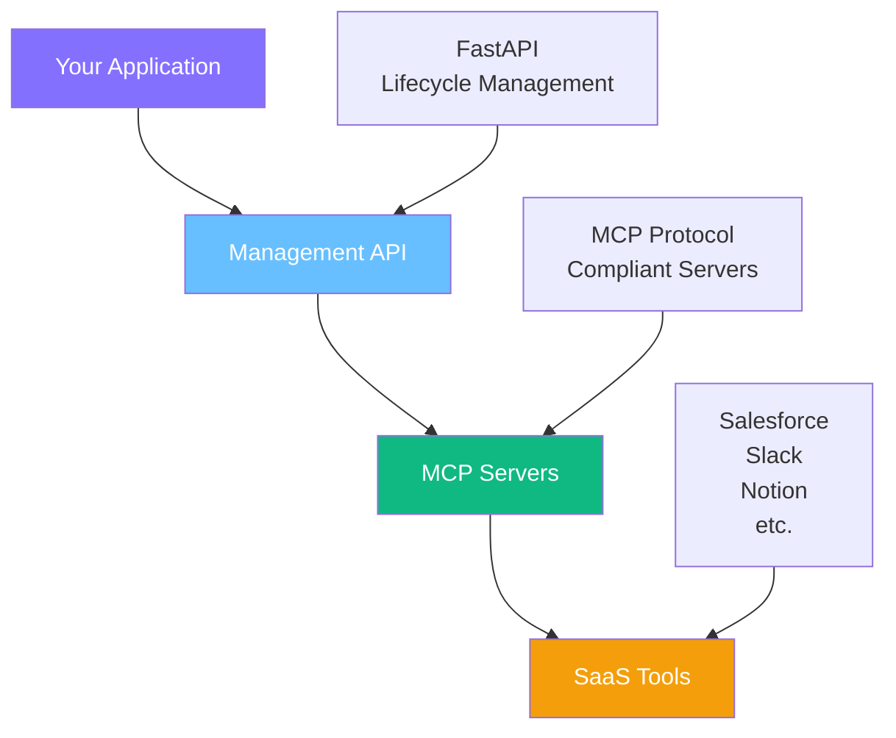

## Platform Overview

Kambrium provides **Model Context Protocol (MCP) Servers** that enable you to connect AI applications to third-party SaaS tools through a standardized protocol. Our platform implements a three-layer architecture designed for secure, scalable access to your business data.

### What is MCP?

The **Model Context Protocol** is an open standard that allows AI applications to securely connect to external data sources and tools. Kambrium provides MCP-compliant servers that translate between the standardized protocol and specific SaaS tool APIs.

---

## Three-Layer Architecture

The Kambrium platform operates through three distinct layers:

### Layer 1: Management API

**Purpose:** High-level administrative interface for managing MCP Server connections

**Implementation:** FastAPI-based service that handles the lifecycle of MCP Server connections

**Core Operations:**

- Get all available MCP Server integrations
- Create new MCP Server connections
- Get your MCP Server connections
- Delete your MCP Server connections
- Edit your MCP Server connections

**Authentication:** OAuth 2.1 with JWT tokens

### Layer 2: MCP Servers

**Purpose:** Protocol-compliant servers that provide standardized access to SaaS tools

**Implementation:** Individual servers for each SaaS integration (Salesforce, Slack, Notion, etc.)

**Function:** Translate between MCP protocol and specific SaaS tool APIs

**Standards Compliance:** Fully compliant with MCP specification

### Layer 3: SaaS Tools

**Purpose:** Your existing business applications and data sources

**Examples:** Salesforce, Slack, Notion, GitHub, and other third-party services

**Integration:** Connected via API keys or OAuth 2.1 flows

---

## Authentication Methods

The platform supports two primary authentication approaches across all layers:

<CardGroup cols={2}>
  <Card title="OAuth 2.1 Client Credentials" icon="shield-check">
    **Best for:** Production applications, server-to-server communication **How
    it works:** - Generate client_id and client_secret in web interface - Use
    Client Credentials Grant flow for short-lived tokens - Automatic token
    refresh capability - Industry standard security
  </Card>

  <Card title="Personal Access Tokens (PATs)" icon="key">
    **Best for:** Development, scripting, CI/CD pipelines **How it works:** -
    Generate long-lived JWT tokens in web interface - Simple "copy-paste"
    experience like traditional API keys - OAuth 2.1 compliant without
    complexity - No token refresh logic required
  </Card>
</CardGroup>

---

## Connection Flow Overview

### Creating MCP Server Connections

**Web Interface (Direct):**

1. Navigate to the Kambrium web interface
2. Select the SaaS tool you want to connect
3. Choose authentication method:
   - **API Key:** Paste your SaaS tool's API key directly
   - **OAuth:** Click "Connect" to initiate OAuth flow with the SaaS provider

**Management API (Programmatic):**

1. Authenticate with Management API using OAuth token or PAT
2. Call "Create MCP Server" endpoint with SaaS tool details
3. For OAuth connections: Direct users to provided authorization URL
4. For API key connections: Include API key in the creation request

### Using MCP Servers

Once created, MCP Servers can be accessed through:

**Standard MCP Protocol:**

- WebSocket or HTTP connections
- Full MCP specification compliance
- OAuth 2.1 authentication required

**Third-party Applications:**

- Applications like Claude can connect via OAuth Authorization Code Flow
- Users grant consent for third-party access
- Standard OAuth scoping and permissions

---

## Security Architecture

### Token-Based Security

All API access uses **OAuth 2.1 JWT tokens** in the `Authorization: Bearer <token>` header:

- **Management API:** Requires valid JWT for all operations
- **MCP Servers:** Require valid JWT for protocol access
- **SaaS Tools:** Credentials managed securely by the platform

### Delegation and Attribution

For applications serving multiple users, the platform supports:

- **Token Exchange (RFC 8693):** Secure delegation of access rights
- **Proper Attribution:** Clear tracking of which user performed which actions
- **Billing and Auditing:** Transparent usage tracking per user

---

## Integration Options

<CardGroup cols={2}>
  <Card title="Direct Integration" icon="user">
    **Who:** Individuals or teams using MCP servers directly **Interface:** Web
    dashboard for setup and configuration **Access:** Direct MCP protocol access
    or third-party applications
  </Card>

  <Card title="Embedded Integration" icon="code">
    **Who:** Developers building applications for their users **Interface:**
    Management API for programmatic control **Access:** Token exchange for
    secure user delegation
  </Card>
</CardGroup>

---

## Getting Started

Choose your integration path:

<CardGroup cols={2}>
  <Card title="Management API" href="/authentication/management-api" icon="cog">
    Learn about programmatic lifecycle management of MCP servers
  </Card>

  <Card
    title="MCP Server Access"
    href="/authentication/mcp-server"
    icon="server"
  >
    Understand how to connect and interact with MCP servers
  </Card>

  <Card
    title="SaaS Integration"
    href="/authentication/integrations"
    icon="plug"
  >
    Set up connections to your business tools
  </Card>

  <Card
    title="Web Dashboard"
    href="https://app.kambrium.com"
    icon="external-link"
  >
    Get started with our visual interface
  </Card>
</CardGroup>

<Note>
  This architecture ensures secure, scalable access to your business data while
  maintaining full compliance with MCP specifications and OAuth 2.1 standards.
</Note>
